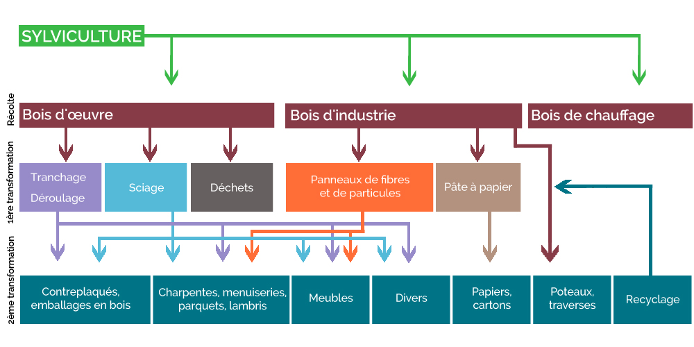

# 🪵 Bois d'oeuvre

Le bois d'oeuvre englobe toutes les pièces de bois utilisées dans la fabrication de meubles (planches de bois massif, lammelé-collé, etc.).&#x20;

## Généralités

Le bois d'oeuvre utilisé dans un meuble a subi plusieurs étapes de transformation :&#x20;

1. Sylviculture : consiste à gérer les forêts (dont un des objectifs est de produire du bois),
2. Première transformation : consiste à exploiter le bois en forêt et à le débiter en scierie de telle sorte qu'il soit ensuite transformés selon les débouchés (ameublement, bâtiment, etc.),&#x20;
3. Deuxième transformation : consiste à conférer de la valeur ajoutée aux bois et à le rendre exploitable pour le consommateur final.&#x20;

<figure><figcaption>
Schéma simplifié du cycle de vie du bois d'oeuvre 
</figcaption></figure>

## Modélisation Ecobalyse

L'ensemble des étapes constitutives des bois d'oeuvre disponibles dans Ecobalyse sont modélisés directement dans un procédé Ecoinvent. Ainsi, différentes hypothèses clés  (ex : consommation d'énergie en scierie, taux de pertes en scierie, procédé/technologie de séchage utilisée, modes de gestion des forêts, etc.) sont retenues au sein de ces procédés.&#x20;

Dès lors, Ecobalyse s'attache à :&#x20;

* éclairer ces enjeux "cachés" à travers l'outil Ecobalyse,
* créer de nouveaux procédés lorsque nécessaire afin de refléter les pratiques de l'industrie. \
  Pour toute demande en ce sens, merci de nous la partager directement sur le canal "Ameublement" de la plateforme collaborative Mattermost (<mark style="color:red;">lien à ajouter</mark>).&#x20;

**Illustration pour la production 1kg de bois d'oeuvre de feuillus sous forme de planche/panneau** : &#x20;

* procédé Ecoinvent : _market for sawnwood, board, hardwood, dried (u=10%), planed (RER)_
* Etapes inclues dans le procédé :&#x20;
  * sylviculture,
  * sciage,
  * séchage,
  * rabotage.

### Procédés disponibles dans Ecobalyse :&#x20;

cf. l'Explorateur Matière pour accéder à la liste des bois d'oeuvre disponibles dans Ecobalyse.&#x20;

<figure><figcaption>
Coût environnemental de bois d'oeuvres séchés disponibles dans Ecobalyse (uPts / m3)
</figcaption></figure>
