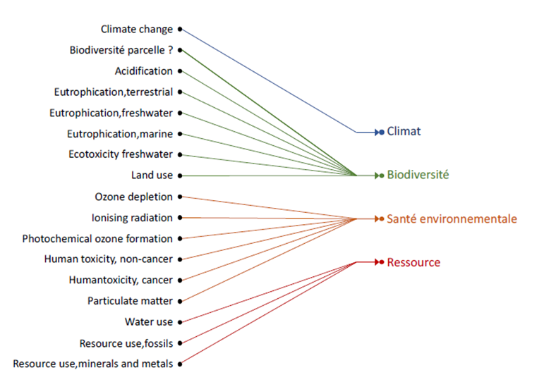

# Indicateurs d'impacts ACV

## Impacts agrégés et impacts détaillés

**2 impacts agrégés**, c'est à dire regroupant différents impacts après normalisation et pondération, sont proposés dans Ecobalyse alimentaire :&#x20;

* un **coût environnemental**, traduisant la version beta de méthodologie présentée aux partenaires le 27 mars 2023, en vue de l'établissement futur d'une méthodologie de calcul pour l'affichage environnemental réglementaire français (cf. [article L.541-9-12 du code de l'environnement](https://www.legifrance.gouv.fr/codes/article\_lc/LEGIARTI000043959458)) ;
* un **score PEF** tel que défini dans la [recommandation de la Commission européenne du 16 décembre 2021](https://eur-lex.europa.eu/legal-content/EN/TXT/?uri=PI\_COM%3AC%282021%299332) sur l'utilisation des méthode d'évaluation des empreintes environnementales.

**Le détail des catégories d'impacts ACV** peut également être visualisé :&#x20;

* Les 16 catégories d'impacts de la méthode PEF ([lien](impacts-consideres.md#16-categories-dimpacts-pef))
* La catégorie d'impact corrigée relative à l'écotoxicité (l[ien](impacts-consideres.md#indicateurs-de-toxicite-et-decotoxicite-corriges))


A terme, deux autres catégories d'impact ACV, relatives à la biodiversité marine et terrestre ("à la parcelle") sont susceptibles d'être introduites.


Les impacts sont ensuite agrégés suivant la **règle de l'affectation unique** introduite dans le rapport du Conseil scientifique. Chaque catégorie d'impacts est ainsi rattachée à la catégorie à laquelle elle contribue le plus.

<figure><figcaption><p>Répartition des catégories suivant la règle de l'affectation unique</p></figcaption></figure>


## Normalisations et pondérations

Les calculs du coût environnemental et du score PEF s'effectuent à partir d'une somme pondérée des catégories d'impacts, chacune étant préalablement normalisée.

$$
ImpactAgrégé =\sum (Pondération_i * \frac{Impact_i}{Normalisation_i})
$$

Les niveaux de normalisation et de pondération sont détaillés dans l'[explorateur des impacts pour l'alimentaire d'Ecobalyse](https://ecobalyse.beta.gouv.fr/#/explore/food).

Pour la construction du coût environnemental, **les mêmes coefficients de normalisation que ceux du score PEF** sont appliqués.

Pour la **pondération**, la méthode de l'affichage environnemental établit que : &#x20;

* la pondération du changement climatique est maintenue à 21,06% ;
* la pondération de l'écotoxicité eau douce est réhaussée à 21,06% (détail des explications [ici](impacts-consideres.md#correction-des-indicateurs-de-toxicite-et-decotoxicite)) ;
* les pondérations des indicateurs de toxicité humaine cancer et non-cancer sont fixées à zéro, ce qui revient à supprimer ces indicateurs du coût environnemental (détail des explications [ici](impacts-consideres.md#correction-des-indicateurs-de-toxicite-et-decotoxicite))
* les autres pondérations sont proportionnelles aux pondérations PEF initiales, mais réduite afin que la somme des pondérations reste bien à 100% après l'introduction des trois modifications précédentes.


Cette règle est une des deux options introduites dans le rapport du Conseil scientifique.


## Unité du coût environnemental

Le coût environnemental est exprimé en _**points d'impacts**_.&#x20;

Ce _**point d'impact**_ provient du "micro-point PEF". Le point PEF correspond à l’impact environnemental annuel d'un habitant européen.&#x20;

## Correctifs sur la toxicité et d'écotoxicité

### Exclusion temporaire des catégories d'impact "toxicité humaine cancer" et "toxicité humaine non cancer"

En l’état, les résultats des indicateurs de toxicité humaine\[1] (cancer et non-cancer) ne sont pas cohérents avec les connaissances scientifiques. En effet, pour les produits alimentaires, l’application stricte de la méthode PEF conduit à attribuer plus d’impacts toxiques à de nombreux produits bio, en comparaison avec leur équivalent conventionnel : blé, tomate, porc, poulet… Ceci s’explique par une sous-estimation des effets toxiques de pesticides de synthèse (cf. problématique 3), couplée à des difficultés de modélisation des engrais organiques qui sont beaucoup utilisés en agriculture biologique. Dans le cadre de la méthode PEF, les impacts associés aux métaux présents dans les effluents d’élevage utilisés comme engrais organiques sont attribués aux productions qui mobilisent ces effluents, et non pas aux productions qui les génèrent. Ceci est contraire au principe même de l’ACV, comme le reconnait la communauté scientifique, notamment le JRC au niveau européen\[2], et le GIS Revalim\[3] qui a d’ailleurs lancé un groupe de travail à ce sujet. Les limites des méthodes actuelles de modélisation de la toxicité humaine aboutissent donc à pénaliser injustement les productions contribuant par ailleurs au bouclage des cycles et à l’autonomie en azote, et notamment les productions biologiques. Ceci est incohérent avec la bibliographie scientifique qui s’accorde sur le fait que les productions biologiques permettent de réduire l’exposition des populations humaines aux risques de toxicité.&#x20;

**=> il est donc proposé de retirer temporairement les deux indicateurs de toxicité humaine (cancer et non cancer), le temps que la communauté scientifique améliore la prise en compte des métaux dans la méthode PEF (travaux en cours).**

<figure><figcaption><p>Impact sur la toxicité humaine cancer du blé conventionnel et bio, décomposé par substance</p></figcaption></figure>

<figure><figcaption><p>Impact sur la toxicité humaine non cancer du blé conventionnel et bio, décomposé par substance</p></figcaption></figure>

### Doublement de la pondération de l'écotoxicité "organique"

Pour les produits alimentaires, les impacts des métabolites, des co-adjuvants et les effets cocktails ne sont pas comptabilisés dans l’ACV à ce jour. D’autre part, le nombre de molécules de synthèse mises sur le marché est tel que les connaissances les concernant sont lacunaires, notamment dans les premières années de commercialisation. Ceci n’est pas le cas pour les molécules utilisées en agriculture biologique (leur nombre étant beaucoup plus limité et leur commercialisation ancienne). De ce fait, la différence d’impacts toxicité/écotoxicité des produits bio et conventionnels est aujourd’hui biaisée.

**=> il est donc proposé de doubler la pondération des impacts écotoxicité associés aux molécules utilisées dans les pesticides de synthèse**.&#x20;

On a donc :

```
etf = etf_organic + etf_inorganic  
etf_corrigé = 2 * etf_organic + etf_inorganic
```

### Amplification du poids de l'écotoxicité

La méthode PEF ne permet d’évaluer que l’impact d’écotoxicité sur l’eau douce. Ainsi, les impacts sur d’autres compartiments, et notamment sur le milieu terrestre, ne sont à ce jour pas comptabilisés dans le PEF (par exemple, il n’y a pas de prise en compte des impacts des pratiques agricoles sur les pollinisateurs). Ainsi, cet indicateur et la pondération PEF associée (1,92%) ne permet pas de refléter la totalité des enjeux liés à l’écotoxicité des substances utilisées en agriculture. En revanche, les experts de l'OFB considèrent que l’indicateur écotoxicité « eau douce » est à ce jour le meilleur indicateur pour approximer l’écotoxicité « totale », sous réserve de le pondérer en conséquence.

Par ailleurs, des travaux doivent être menés dans les prochains mois pour consolider un indicateur de biodiversité locale (ou "à la parcelle") dans l'ACV. Dans l'attente d'un tel indicateur, réhausser la pondération de l'indicateur d’écotoxicité permet de compenser l’absence de prise en compte des impacts des pratiques agricoles sur la biodiversité locale.

***

\[1] Dans l’ACV, la toxicité humaine des molécules/métaux n’englobe pas les impacts liés à l’ingestion des aliments. Elle ne concerne que les impacts de santé humaine liés à la présence des molécules/métaux dans l’environnement (eau, air, sol)

\[2] M. Boschiero et al. 2023, [https://doi.org/10.1016/j.eiar.2023.107187](https://doi.org/10.1016/j.eiar.2023.107187)

\[3] Groupement d’Intérêt Scientifique Revalim composé de l’INRAE, de l’Ademe et des Instituts Techniques agricoles, en charge de la base de données ACV Agribalyse (méthode PEF)

## Correctif sur l'indicateur "consommation d'eau"

Dans les inventaires utilisés, et notamment dans les ICV d'Agribalyse pour la partie alimentaire, les flux de consommation d'eaux étaient des flux mondiaux, même pour des produits français. Étant donné que l'impact de la consommation d'1L d'eau mondial est plus impactant (42.95) que la consommation d'1L d'eau en France (6.98), l'impact des produits faits en France étaient surestimé.

Pour corriger cela, il est proposé d'appliquer un correctif à la méthode de caractérisation, en modifiant l'impact des flux de consommation d'eaux mondiaux afin que cela corresponde à l'impact de la consommation d'eau en France.


_Limites_ : pour les produits importés utilisant de l'eau mondiale ({GLO}), les résultats sont faussés. Ce correctif doit rester temporaire en attendant un correctif lors des prochaines mises à jour des données, notamment d'Agribalyse.

