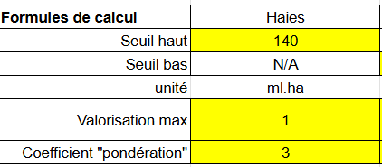

# Complément hors ACV

La valorisation des services écosystémiques est intégrée à travers l'introduction de compléments au cadre ACV. Ces compléments visent à prendre en compte les **externalités environnementales de certains modes de production** telles que désignées dans l’[article 2 de la loi Climat et résilience](https://www.legifrance.gouv.fr/jorf/article_jo/JORFARTI000043956979). Ces externalités ne sont aujourd'hui pas intégrées à l'ACV. Pourtant, elles sont essentielles pour appréhender au mieux l'impact systémique de l'agriculture, notamment à l'échelle des territoires. En effet, les pratiques agricoles façonnent grandement les écosystèmes et les paysages, que ce soit en termes de biodiversité (maintien de zones refuges, de corridors écologiques, d'une mosaïque paysagère diversifiée, etc.) ou en termes de résilience face aux aléas divers (préservation contre l'érosion des sols, bouclage des cycles et moindre dépendance à certains nutriments exogènes, régulation naturelle des ravageurs de cultures, etc.). Cinq compléments sont ainsi ajoutés pour prendre en compte ces effets.

## Introduction et formules de calcul

Les services écosystémiques sont attachées à la production agricole. Ils sont donc intégrés à l'étape "Ingrédients" du cycle de vie.

Pour chaque ingrédient, le coût environnemental est la somme de la composante ACV du coût environnemental et de chacun des 5 services écosystémiques introduits ci-après :&#x20;

$$
CoûtEnvironnemental = ComposanteACV + \sum_{1}^{5}ServicesEcosystémiques
$$

2 types de services écosystémiques sont à distinguer :&#x20;

* Les services écosystémiques "cultures", qui s'appliquent aux productions végétales, ainsi qu'aux productions animales via les végétaux consommés dans la ration alimentaire (en intégrant également les prairies).
* Les services écosystémiques "élevages" qui ne s'appliquent qu'aux productions animales.

| Service écosystémique  | Application                         | Valeur                                   |
| ---------------------- | ----------------------------------- | ---------------------------------------- |
| Haies                  | Cultures (et élevage via la ration) | Valeur toujours positive                 |
| Taille de parcelles    | Cultures (et élevage via la ration) | Valeur toujours positive                 |
| Diversité culturale    | Cultures (et élevage via la ration) | Valeur toujours positive                 |
| Prairies permanentes   | Élevages                            | Valeur toujours positive                 |
| Chargement territorial | Élevages                            | Valeur pouvant être positive ou négative |

### Rations animales

Les rations animales utilisées pour les calculs des compléments pour les productions animales sont détaillées dans l'onglet "animal-kg" \[_lien vers le tableur à venir en vue du webinaire sur les services écosystémiques animaux_].

### Services écosystémiques "cultures" / Groupes de culture

La modélisation proposée (en "niveau 1") dans l'outil Ecobalyse rend compte des impacts et des services écosystémiques à partir de quelques paramètres simples caractérisant les ingrédients : nature de la culture, pays, label éventuel (Agriculture biologique par exemple).

Pour caractériser au mieux les différents ingrédients proposés dans Ecobalyse, chacun est rattaché à un **groupe de culture**.

Les 28 groupes de culture considérés sont ceux du [Registre Parcellaire Graphique](https://geoservices.ign.fr/ressource/194788) niveau 1 (parcelles totales, cultures principales par parcelle, France métropolitaine, millésime 2021) :

| Groupes de culture                    |
| ------------------------------------- |
| BLE TENDRE                            |
| MAIS GRAIN ET ENSILAGE                |
| ORGE                                  |
| AUTRES CEREALES                       |
| COLZA                                 |
| TOURNESOL                             |
| AUTRES OLEAGINEUX                     |
| PROTEAGINEUX                          |
| PLANTES A FIBRES                      |
| SEMENCES                              |
| GEL (surfaces gelées sans production) |
| GEL INDUSTRIEL                        |
| AUTRES GELS                           |
| RIZ                                   |
| LEGUMINEUSES A GRAIN                  |
| FOURRAGE                              |
| ESTIVES LANDES                        |
| PRAIRIES PERMANENTES                  |
| PRAIRIES TEMPORAIRES                  |
| VERGERS                               |
| VIGNES                                |
| FRUITS A COQUES                       |
| OLIVIERS                              |
| AUTRES CULTURES INDUSTRIELLES         |
| LEGUMES-FLEURS                        |
| CANNE A SUCRE                         |
| ARBORICULTURE                         |
| DIVERS                                |

Pour chacun de ces groupes de culture, 3 scénarios sont considérés en première approche

| Scénario  | Champ d'application                                                          |
| --------- | ---------------------------------------------------------------------------- |
| Référence | Cultures végétales (et prairies) en France et en agriculture conventionnelle |
| Bio       | Cultures végétales (et prairies) en France et en agriculture biologique      |
| Import    | Cultures végétales (et prairies) hors France                                 |


Les données mobilisées par l'OFB ou le service statistique du ministère de l'agriculture concernant uniquement les productions en France, des données par défaut sont utilisées pour les productions importées. En l'absence d'informations similaires, des données majorantes sont appliquées.


### Services écosystémiques "cultures" / application aux productions animales

Pour appliquer les services écosystémiques "cultures" (haies, tailles de parcelle et diversité culturale) aux ingrédients issus de l'élevage (produits laitiers ou viandes), une logique d'affectation similaire à celle appliquée pour les catégories d'impacts en ACV est appliquée :&#x20;

* L'élevage nécessite des cultures et des prairies pour l'alimentation animale
* Chaque culture (et prairie) mobilisée génère des services écosystémiques dont la modélisation est détaillé ci-après

### Formules de calcul

L'ensemble des formules de calcul implémentées pour le calcul de chacun des 5 services écosystémiques, en distinguant les services écosystémiques "cultures" et les services écosystémiques "élevages" sont détaillés dans le tableur suivant :&#x20;

[https://docs.google.com/spreadsheets/d/1wkwTva7ofeIHJorrlwmJuv-x0uB2jud4r6pqb7aJOwc/edit?usp=sharing](https://docs.google.com/spreadsheets/d/1wkwTva7ofeIHJorrlwmJuv-x0uB2jud4r6pqb7aJOwc/edit?usp=sharing)

## Complément "haies"&#x20;

### Approche globale

En l'absence de données de quantification des externalités positives liées aux haies, Ecobalyse approxime les externalités positives des haies par la quantité de haies (ml/ha)

* Niveau 1 ⇒ complément fonction du label x type de productions
* Label bio dans un premier temps, mais il est possible d'intégrer d'autres labels dès que des données sont disponibles&#x20;

⇒ Objectif : différencier le bio et le conventionnel selon la quantité de haies qui caractérise chacun de ces systèmes

### Données

Croisement entre :

* Registre Parcellaire Graphique (RPG) “conventionnel” x BD HAIE
* RPG Bio x BD HAIE

Par défaut on considère que RPG conventionnel = RPG (IGN) - RPG Bio (Agence Bio)\
 

<figure><figcaption></figcaption></figure>

#### Périmètre :

* Emprise géographique : France métropolitaine → données exhaustives et donc moyennes par culture et mode de production (bio / non bio) significatives
* Groupes de cultures : prise en compte de 22 des 24 groupes de cultures en vigueur dans le RPG\*
* Déclinaison des calculs : nationale (France métropolitaine), régionale, départementale (+ données détaillées par parcelle disponibles également)
* Millésime RPG : 2021

#### Sources des données mobilisées :&#x20;

* RPG niveau 1 (parcelles totales, cultures principales par parcelle, France métropolitaine, millésime 2021) :[ https://geoservices.ign.fr/ressource/194788](https://geoservices.ign.fr/ressource/194788)
* Agence bio (parcelles en AB) :[  https://www.data.gouv.fr/fr/datasets/616d6531c2951bbe8bd97771/](https://www.data.gouv.fr/fr/datasets/616d6531c2951bbe8bd97771/)  (National - année 2021)
* Dispositif de suivi des bocages - DSB de l'IGN/OFB (haies) :[ https://geoservices.ign.fr/bdtopo#telechargementshpreg](https://geoservices.ign.fr/bdtopo) (la BD HAIE est contenue dans la BD TOPO, dossier « Occupation du Sol »)

### Synthèse des résultats obtenus

<figure><figcaption></figcaption></figure>

&#x20;Par rapport aux parcelles Non bio , les parcelles Bio présentent en moyenne :

* \+ de haies pour 15/20 groupes de cultures
* autant de haies  (- de 10% de différence) pour 5/20 gpes de cultures (Fourrage, Prairies permanentes, Prairies temporaires, Fruits à coque, Oliviers)

Quel que soit le mode de production, les groupes de cultures avec :

* le + de haies sont les prairies
* le - de haies sont les estives et landes (milieux ouverts)

Les + gros écarts entre Bio et Non bio concernent les groupes de cultures:

* Légumes/fleurs en valeur absolue (+ 46 ml/ha pour le bio)
* Autres cultures industrielles en valeur relative (+ 306% pour le bio)

### Formule de calcul

La formule de calcul mobilisée pour convertir les linéaires de haies par hectare en points d'impacts est intégrée dans le [tableur de calcul](https://docs.google.com/spreadsheets/d/1wkwTva7ofeIHJorrlwmJuv-x0uB2jud4r6pqb7aJOwc/edit?usp=sharing), onglet "cultures".

<figure><figcaption>
Rq : image illustrative - les valeurs de référence sont dans le tableur en ligne
</figcaption></figure>

La formule de calcul appliquée est :&#x20;

$$
SE_{haies} = Coef_{haies}*Surface*(min(1;ComplémentBrut/SeuilHaut)-1+ValoMax)
$$

Avec :&#x20;

* CoefHaies : Un coefficient global appliqué au résultat et qui pilote le poids donné à ce résultat dans le coût environnemental. Dans le cadre ACV, cela correspond au rapport entre le coefficient de pondération et le facteur de normalisation de la catégorie d'impact considérée.
* ComplémentBrut : La valeur de linéraire de haie par hectare considérée pour le groupe de culture (blé, maïs, orge...) et le scénario considéré (bio, import, référence). Ces valeurs, tirées de l'exploitation des données introduites ci-dessus, sont listées dans l'onglet "Références par groupe de culture" du [tableur de calcul](https://docs.google.com/spreadsheets/d/1wkwTva7ofeIHJorrlwmJuv-x0uB2jud4r6pqb7aJOwc/edit?usp=sharing). &#x20;
* SeuilHaut : La valeur, en mètre linéaire de haies par hectare, au-delà de laquelle il n'est plus considéré d'augmentation des services écosystémiques. En l'occurrence, un seuil de 140 ml/ha est considérée à partir de la bibliographie.
* ValoMax : La valeur donnée au service écosystémique, avant application du coefficient global et multiplication par la surface, dans la configuration dans laquelle il est au maximum (donc au-delà de 140 ml/ha).

<figure><figcaption></figcaption></figure>

## Complément "taille des parcelles"

### Approche globale

En l'absence de données données disponibles sur les IAE hors haies, on approxime les externalités positives des autres IAE par la taille des parcelles. La logique est que les plus petites parcelles génèrent plus de « bords de champs » et autres zones lisières

* Niveau 1 ⇒ complément fonction du label x type de productions
* Label bio dans un premier temps, mais besoin de données sur autres labels

⇒ Objectif : différencier le bio et le conventionnel selon la taille des parcelles qui caractérise chacun de ces systèmes

### Données

Etude de la taille des parcelles :

* RPG “conventionnel”
* RPG Bio (Agence bio)

Par défaut on considère que RPG conventionnel = RPG (IGN) - RPG Bio (Agence Bio)

#### Périmètre

* Emprise géographique : France métropolitaine → données exhaustives et donc moyennes par culture et mode de production (bio / non bio) significatives
* Groupes de cultures : prise en compte de 22 des 24 groupes de cultures en vigueur dans le RPG\*
* Déclinaison des calculs : nationale (France métropolitaine), régionale, départementale (+ données détaillées par parcelle disponibles également)
* Millésime RPG : 2021

#### Sources des données mobilisées :

* RPG niveau 1 (parcelles totales, cultures principales par parcelle, France métropolitaine, millésime 2021) :[ https://geoservices.ign.fr/ressource/194788](https://geoservices.ign.fr/ressource/194788)
* Agence bio (parcelles en AB) :[  https://www.data.gouv.fr/fr/datasets/616d6531c2951bbe8bd97771/](https://www.data.gouv.fr/fr/datasets/616d6531c2951bbe8bd97771/)  (National - année 2021)

### Synthèse des résultats obtenus

<figure><figcaption></figcaption></figure>

Par rapport aux parcelles Non bio , les parcelles Bio sont en moyenne :

* \+ petites pour 10/21 groupes de cultures (Blé tendre, Orge, Colza, Protéagineux, Riz, Estives et landes, Vergers, Fruits à coque, Autres cultures industrielles, Légumes ou fleurs)
* de même taille (- de 10% de différence) pour 6/21 groupes de cultures (Maïs grain et ensilage, Autres céréales, Tournesol, Prairies permanentes, Prairies temporaires, Vignes)
* \+ grandes pour 5/21 groupes de cultures (Autres oléagineux, Légumineuses à grains, Fourrage, Oliviers, Divers)

Les + gros écarts (hors Divers) entre Bio et Non bio concernent les Autres cultures industrielles (-4.5 ha soit -76% pour le Bio)

### Formule de calcul

La formule de calcul de calcul mobilisée pour convertir la taille moyenne des parcelles en points d'impacts est intégrée dans le [tableur de calcul](https://docs.google.com/spreadsheets/d/1wkwTva7ofeIHJorrlwmJuv-x0uB2jud4r6pqb7aJOwc/edit?usp=sharing), onglet "cultures".

<figure><figcaption>
Rq : image illustrative - les valeurs de référence sont dans le tableur en ligne
</figcaption></figure>

La formule de calcul appliquée est :&#x20;

$$
SE_{surface} = Coef_{surface}*Surface*(max((1-ComplémentBrut/SeuilBas);0)-1+ValoMax)
$$

Avec :

* CoefSurface : Un coefficient global appliqué au résultat et qui pilote le poids donné à ce résultat dans le coût environnemental. Dans le cadre ACV, cela correspond au rapport entre le coefficient de pondération et le facteur de normalisation de la catégorie d'impact considérée.
* ComplémentBrut : La valeur de la surface moyenne des parcelles considérée pour le groupe de culture (blé, maïs, orge...) et le scénario considéré (bio, import, référence). Ces valeurs, tirées de l'exploitation des données introduites ci-dessus, sont listées dans l'onglet "Références par groupe de culture" du [tableur de calcul](https://docs.google.com/spreadsheets/d/1wkwTva7ofeIHJorrlwmJuv-x0uB2jud4r6pqb7aJOwc/edit?usp=sharing).
* SeuilBas : La valeur, en hectares, au-delà de laquelle il n'est plus considéré de services écosystémiques liés à la taille des parcelles. En l'occurrence, un seuil de 8 hectares est considéré. Il est donc considéré que, pour qu'une culture génère des services écosystémiques liés à la taille des parcelles correspondantes, celles-ci doivent être en moyenne d'une surface inférieure à 8 hectares.
* ValoMax : La valeur donnée au service écosystémique, avant application du coefficient global, dans la configuration dans laquelle il est au maximum (pour une surface moyenne théorique de 0 hectares).

<figure><figcaption></figcaption></figure>

## Complément "diversité agricole"

### Approche globale

L'objectif de ce complément est de prendre en compte les services écosystémiques rendus par la diversité culturale en les approximant par la mesure de cette diversité à travers l'**indice de Simpson**.

* Calcul de l’indice de Simpson des Petites Régions Agricoles (PRA)
* Par groupe de cultures, calcul de la moyenne des indices de Simpson des PRA pondérée par la surface du groupe de cultures dans chaque PRA





### Données

* Surfaces conventionnelles/bio par cultures (227) et par PRA (750) (hors Outre-mer)
* Surfaces conventionnelles/bio par groupe de cultures et par PRA

### Synthèse des résultats obtenus

<figure><figcaption></figcaption></figure>

L’indice de Simpson des surfaces bio est plus élevé que celui des surfaces conventionnelles, hormis pour le riz, les vergers, vignes, fruits à coque, et oliviers.

### Formule de calcul

La formule de calcul de calcul mobilisée pour convertir l'indice de Simpson moyen en points d'impacts est intégrée dans le [tableur de calcul](https://docs.google.com/spreadsheets/d/1wkwTva7ofeIHJorrlwmJuv-x0uB2jud4r6pqb7aJOwc/edit?usp=sharing), onglet "cultures".

<figure><figcaption>
Rq : image illustrative - les valeurs de référence sont dans le tableur en ligne
</figcaption></figure>

La formule de calcul appliquée est :&#x20;

* Lorsque l'indice de Simpson moyen est inférieur au seuil bas :&#x20;

$$
SE_{diversité} = 0
$$

* Lorsque l'indice de Simpson moyen est supérieur au seuil haut :&#x20;

$$
SE_{diversité} = Coef_{diversité}*Surface*ValoMax
$$

* Lorsque l'indice de Simpson est compris entre le seuil bas et le seuil haut : &#x20;

$$
SE_{diversité} = Coef_{diversité}*Surface*(ComplémentBrut-SeuilHaut+ValoMax)
$$

Avec :&#x20;

* CoefDiversité : Un coefficient global appliqué au résultat et qui pilote le poids donné à ce résultat dans le coût environnemental. Dans le cadre ACV, cela correspond au rapport entre le coefficient de pondération et le facteur de normalisation de la catégorie d'impact considérée.
* ComplémentBrut : La valeur de l'indice de Simpson moyen des parcelles considérées pour le groupe de culture (blé, maïs, orge...) et le scénario considéré (bio, import, référence). Ces valeurs, tirées de l'exploitation des données introduites ci-dessus, sont listées dans l'onglet "Références par groupe de culture" du [tableur de calcul](https://docs.google.com/spreadsheets/d/1wkwTva7ofeIHJorrlwmJuv-x0uB2jud4r6pqb7aJOwc/edit?usp=sharing).
* SeuilBas : La valeur de l'indice de Simpson en dessous de laquelle il n'est plus considéré de services écosystémiques liés à la diversité.
* SeuilHaut : La valeur de l'indice de Simpson au-delà de laquelle il est considéré que la valeur maximale des services écosystémiques valorisés est atteinte.
* ValoMax : La valeur donnée au service écosystémique, avant application du coefficient global et multiplication par la surface.

<figure><figcaption></figcaption></figure>

## Complément "prairies"

### Approche globale et données mobilisées

Ce complément vise à prendre en compte les externalités positives produites par les prairies en les approximant par la quantité de prairies (ha), c'est-à-dire en isolant la valeur de surfaces de prairies dans chaque ICV. Ce complément ne s'applique qu'aux ingrédients d'origine animale, lorsque l'élevage mobilise des prairies.


Seules les surfaces de prairies permanentes sont valorisées dans le calcul de ce complément. Il n'est pas considéré de service écosystémique lié à la mobilisation de prairies temporaires.


### Exemple de résultats

<figure><figcaption></figcaption></figure>

### Formule de calcul

La formule mobilisée pour convertir les surfaces de prairies en services écosystémiques est mobilisée dans l'onglet "Elevage" du [tableur de calcul](https://docs.google.com/spreadsheets/d/1wkwTva7ofeIHJorrlwmJuv-x0uB2jud4r6pqb7aJOwc/edit?usp=sharing). Elle s'écrit simplement :&#x20;

$$
SE_{prairies} = Coef_{prairies}*Surface_{prairies}
$$

Avec :

* CoefPrairies : Un coefficient global appliqué au résultat et qui pilote le poids donné à ce résultat dans le coût environnemental. Dans le cadre ACV, cela correspond au rapport entre le coefficient de pondération et le facteur de normalisation de la catégorie d'impact considérée.
* SurfacePrairies : La surface de prairies permanentes mobilisée, telle qu'issue directement de l'inventaire de cycle de vie mobilisé. Cette surface est exprime en m2.an.

Il est donc proposé de valoriser la mobilisation de prairies permanentes de façon simplement linéaire. Chaque m2.an de prairie permanente mobilisée se traduit par un service écosystémique d'une valeur de CoefPrairies.

## Complément "chargement territorial"

### Approche globale

Ce complément vient prendre en compte les enjeux liés à la densité territoriale en élevage. Il s'agit ainsi de modéliser le fait que :&#x20;

* l'élevage est utile, sur un territoire, pour le bouclage des cycles ou encore l'apport locale d'intrants pour les cultures, bio notamment ;
* a contrario, un territoire qui présenterait une trop forte densité territoriale en élevage peut se retrouver avec des impacts environnementaux propres à cette situation (ex : phénomène des algues vertes).


Contrairement aux 4 premiers compléments qui ne modélisent que des services écosystémiques, c'est à dire des impacts positifs (donc des points d'impacts négatifs) liés à des cultures ou modes d'élevage, le complément "chargement territorial" peut à la fois modéliser des services écosystémiques (pour un élevage qui viendrait majoritairement de territoires sur lesquels la présence de cet élevage bénéficie à l'équilibre territorial et au bouclage local du cycle de l'azote), mais aussi des impacts négatifs (pour un élevage qui viendrait majoritairement de territoires sur lesquels la densité d'élevage observée est déjà très importante).


Pour appréhender le chargement territoriale, la **maille géographique considérée est le département**. Ce choix apparaît à la fois cohérent en termes de vision locale pour le bouclage du cycle de l'azote, mais aussi adapté pour la mobilisation de données.

Ainsi, des données sont mobilisées pour estimer, sur chaque département, le nombre d'animaux d'élevage présents : bovins, ovins, caprins, porcins, lapins, volaille, équités. Ces données permettent d'estimer, pour chaque département, le nombre d'unité gros bétail (UGB) par hectare de surface agricole utile (SAU).&#x20;

Une formule est ensuite proposée (cf. ci-après), pour traduire ce nombre d'UGB / ha soit en service écosystémique pour les départements sur lesquels la densité d'élevage est faible, soit en impact environnemental pour les départements sur lesquels la densité d'élevage est forte.

A partir des consultations conduites en 2023, il est considéré :&#x20;

* une valeur nulle entre 1 et 1,5 UGB/ha ;
* des services écosystémiques pour l'élevage issu de départements  dont la densité est inférieure à 1 UGB par hectare de SAU ;
* des impacts environnementaux pour l'élevage issu de départements dont la densité est supérieure à 1,5 UGB par hectare de SAU.&#x20;

Pour chaque type d'animal, en distinguant bio et conventionnel, on calcul ensuite la moyenne de ce service/impact écosystémique pondérée par la répartition des animaux concernés dans les différents départements. Pour calculer ensuite le service / impact écosystémique pour 1 kg de chaque produit, on multiplie cette valeur par la contribution en UGB de chaque kilo.

La modélisation ainsi proposée fait ressortir des écarts entre les catégories d'animaux élevés. Schématiquement :&#x20;

* les porcins et les volailles sont plus concentrés sur des départements à forte densité en élevage que les bovins ;
* une différence est notés pour l'élevage bio qui paraît moins concentré sur ces départements à forte densité en élevage ;
* les caprins et les ovins sont plus répartis sur le territoire, avec une résultante globalement positive (plus d'apport lié à la présence sur des départements à faible densité en élevage que d'impact liés à la présence sur des départemnts à forte densité).

<figure><figcaption></figcaption></figure>

### Données

Les données mobilisées, distinguant l'élevage conventionnel et l'élevage bio, sont disponibles dans l'onglet Hypothèses chargement du [tableur de calcul](https://docs.google.com/spreadsheets/d/1wkwTva7ofeIHJorrlwmJuv-x0uB2jud4r6pqb7aJOwc/edit?usp=sharing).

Les données mobilisées sont essentiellement :&#x20;

* les surfaces agricoles utiles par département ;
* le nombre d'animaux par département et par catégorie ;
* le nombre d'animaux élevés en agriculture biologique, par département et par catégorie.

### Formule

Pour modéliser le service écosystémique (ou l'impact) lié au chargement territoriale, différentes formules sont successivement appliquées.

&#x20;Formule :&#x20;

$$
SE_{chargement} = Coef_{chargement}*Nbr_{UGB/kg}*Chargement_{groupeXmode d'élevage}
$$

&#x20;Avec :&#x20;

* CoefChargement : Un coefficient global appliqué au résultat et qui pilote le poids donné à ce résultat dans le coût environnemental. Dans le cadre ACV, cela correspond au rapport entre le coefficient de pondération et le facteur de normalisation de la catégorie d'impact considérée. Ce coefficient est dans l'onglet "Elevage" du [tableur de calcul](https://docs.google.com/spreadsheets/d/1wkwTva7ofeIHJorrlwmJuv-x0uB2jud4r6pqb7aJOwc/edit?usp=sharing).
* Nbr UGB/kg : Le nombre d'UGB mobilisé par kg de produit considéré. Ce nombre dépend à la fois du groupe d'animal considéré (bovin / vache), mais aussi du type de production (viande, lait, oeufs...). Les valeurs considérées sont détaillées dans l'onglet "Détail chargement" du [tableur de calcul](https://docs.google.com/spreadsheets/d/1wkwTva7ofeIHJorrlwmJuv-x0uB2jud4r6pqb7aJOwc/edit?usp=sharing).
* Chargement groupeXmode d'élevage : Pour chaque groupe d'animal et chaque mode d'élevage considéré (bio, import, référence) , on recherche la résultante du calcul du service écosystémique (ou de l'impact) départemental moyen pondéré par la présence du groupe d'animal sur chaque département. Ce calcul, est détaillé étape par étape, dans l'onglet "Hypothèses chargement" du [tableur de calcul](https://docs.google.com/spreadsheets/d/1wkwTva7ofeIHJorrlwmJuv-x0uB2jud4r6pqb7aJOwc/edit?usp=sharing).

Dans chaque département, le service écosystémique (ou l'impact) est calculé à partir de la densité d'élevage, exprimée en UGB / hectare de SAU, en appliquant la formule cubique suivante qui modélise les effets recherchés, avec notamment une valeur proche de 0 entre 1 et 1,5 UGB / ha.

$$
ContributionDpt = -1,067 * densité^3 +4,000 * densité^2-4,933*densité+2,000
$$

<figure><figcaption></figcaption></figure>

A partir de cette contribution département, le chargement attribué à chaque groupe et mode d'élevage est établi à partir d'une somme pondérée de la contribution départementale par la présence des animaux considérés sur chaque département.&#x20;

## Traitement des produits agricoles importés

Le travail exposé dans la présente page de documentation mobilise uniquement des données propres à l'élevage et à la culture sur le territoire français. En l'absence de données similaires pour les productions importées, des valeurs conservatrices sont considérées : faible linéaire de haies, tailles de parcelles importantes, diversité agricole limitée, chargement plus impactant. Le complément relatif aux prairies, en revanche, est nativement mobilisable pour tous les inventaires de cycle de vie dont il mobilise simplement l'information sur les surface de prairies mobilisées.

A l'avenir, un travail plus précis pourrait être réalisé en mobilisant des données similaires aux données mobilisées pour l'agriculture française.
