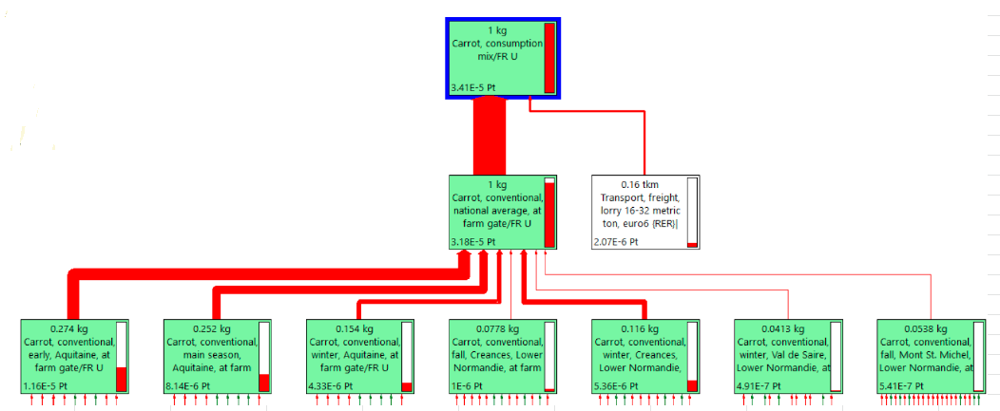

# 🥕 Carotte

## Choix de procédés

Considérée comme un ingrédient agricole (at farm), la carotte est modélisée à travers les procédés suivants :&#x20;

| Label / Origine        | France                                               | Autres pays                                                                                                                        |
| ---------------------- | ---------------------------------------------------- | ---------------------------------------------------------------------------------------------------------------------------------- |
| Conventionnelle        | Carrot, conventional, national average, at farm gate | 
Carrot, conventional, national average, at farm gate <strong>ou (à venir) :</strong> Carrot {RoW}| carrot production*
 |
| Agriculture biologique | Carrot, organic, Lower Normandy, at farm gate        | Carrot, organic, Lower Normandy, at farm gate                                                                                      |

Les procédés retenus sont prioritairement des procédés "at farm", c'est à dire des procédés traduisant l'impact de l'ingrédient en sortie de ferme, avant que ne soit par exemple intégré l'impact du transport vers un lieu de transformation ou encore l'impact du conditionnement.


Vérifier que le procédé Carrot {RoW}\* n'intègre pas déjà de transport ou de conditionnement.


## Analyse des procédés disponibles

La base Agribalyse permet de distinguer 14 inventaires de cycle de vie pour la carotte.&#x20;

* 12 carottes France "at farm" :&#x20;
  * Carrot, conventional, early, Aquitaine, at farm gate
  * Carrot, conventional, fall, Creances, Lower Normandie, at farm gate
  * Carrot, conventional, fall, Mont St. Michel, Lower Normandie, at farm gate
  * Carrot, conventional, fall, Val de Saire, Lower Normandie, at farm gate
  * Carrot, conventional, main season, Aquitaine, at farm gate
  * Carrot, conventional, main season, Aquitaine, with water footprint, at farm gate
  * Carrot, conventional, national average, at farm gate
  * Carrot, conventional, winter, Aquitaine, at farm gate
  * Carrot, conventional, winter, Creances, Lower Normandie, at farm gate
  * Carrot, conventional, winter, Mont St. Michel, Lower Normandie, at farm gate
  * Carrot, conventional, winter, Val de Saire, Lower Normandie, at farm gate
  * **Carrot, organic, Lower Normandy, at farm gate**
* 1 moyenne nationale France tirée de 6 carottes conventionnelles (cf. schéma ci-après)
  * **Carrot, conventional, national average, at farm gate**
* 1  carotte "reste du monde" :&#x20;
  * **Carrot {RoW}| carrot production | Cut-off, S - Copied from Ecoinvent**

L'analyse comparée des impacts donne :&#x20;

<figure><figcaption>
Conventionnel vs bio - source: AGB3.0 via Simapro, EF3.0 (adapted)
</figcaption></figure>

<figure><figcaption>
source: AGB3.0 via Simapro, EF3.0 (adapted)
</figcaption></figure>


**Axes de progrès ?**

Les données ICV disponibles dans Agribalyse permettraient potentiellement d'introduire une distinction suivant :&#x20;

* L'origine géographique par région française (Aquitaine, Basse Normandie...)
* La saisonnalité (early, fall, main season, winter)


## Mix de consommation

La carotte "mix de consommation" France proposée dans Agribalyse s'appuie sur la carotte conventionnelle France.

Un transport de 160 km en camion y est ajouté.

<figure><figcaption></figcaption></figure>

## Identification de l'origine par défaut

Pour déterminer l'origine d'un ingrédient par défaut, chaque ingrédient est classé dans l'une des 4 catégories suivantes :&#x20;

1. Ingrédient très majoritairement produit en France (> 95%) => origine par défaut : FRANCE
2. Ingrédient très majoritairement produit en Europe/Maghreb (>95%) => transport par défaut : EUROPE/MAGHREB&#x20;
3. Ingrédient produit également hors Europe (> 5%) => transport par défaut : PAYS TIERS
4. Ingrédient spécifique (ex. Haricots et Mangues)&#x20;

**Carotte => catégorie 3 : PAYS TIERS** (source : Agreste)&#x20;
