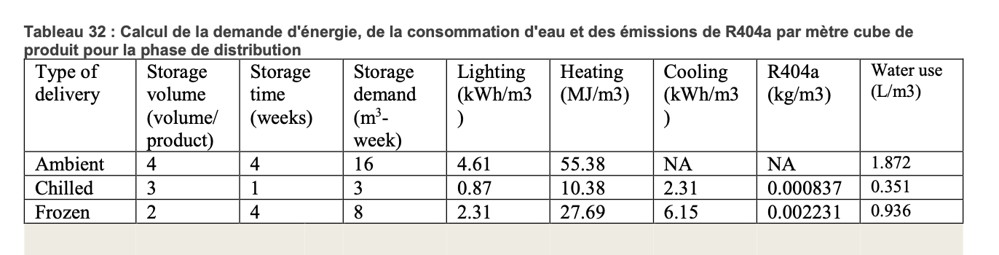

# 👷‍♀️ Etape 4 : distribution

Dans un souci d'harmonisation avec les autres catégories de produits, l'étape de distribution telle que présentée dans Ecobalyse couvre en fait 2 étapes de la documentation Agribalyse :

* le stockage dans une plateforme de distribution
* la vente au détail

Une analyse de sensibilité fait ressortir le fait que la vente au détail a un impact préponderrant par rapport au stockage dans une plateforme de distribution. Aussi, l'impact de la distribution considéré est concentré sur la vente au détail

### 1. Plateforme de distribution (négligé) 

Hormis les transports, cette étape du cycle de vie a un impact qui provient de :

* la consommation d'énergie de la plateforme de distribution.
  * électricité
  * chaleur
* la consommation d'eau de la plateforme de distribution
* l'émission de gaz réfrigérant (r404) (négligé pour l'instant mais dont l'intégration doit être considérée)

Pour estimer l'impact d'un produit, on a besoin de sa densité. Les hypothèses de la documentation Agribalyse sont reprises :

<figure><figcaption></figcaption></figure>

<figure><figcaption></figcaption></figure>

À partir de ces données et de l'impact unitaire de chaque procédé, on peut en déduire l'impact de l'étape de distribution en µPt PEF par kg de produit.

On obtient :

* 0.37 µPt PEF en moyenne pour les produits "Ambient"
* 0.14 µPt PEF en moyenne pour les produits "Chilled"
* 0.38 µPt PEF en moyenne pour les produits "Frozen"

Sachant que l'aliment non liquide ayant le moins d'impact est la patate douce avec un score PEF de 37 µPt PEF/kg. Même dans ce cas extrême l'impact de la distribution (0.14 µPt PEF) représente moins de 1% de l'impact du produit. C'est pourquoi on fait l'hypothèse d'ignorer ces impacts.

### 2. Vente au détail 

### Impact 

L'impact de cette étape provient de :

* la consommation d'énergie du magasin.
  * électricité
  * chaleur
* la consommation d'eau du magasin
* l'émission de gaz réfrigérant (r404) (négligé pour l'instant)

### Calcul du volume 

On calcule le volume du produit à partir de sa densité. Ce calcul est détaillée sur la page Densité.

### Calcul de l'impact 

L'impact est la multiplication du volume par les différentes consommations détaillées dans le tableau ci-dessous :

<figure><figcaption>
Méthodologie AGB 3.0-20200218_rapport-vf2.pdf
</figcaption></figure>

\
