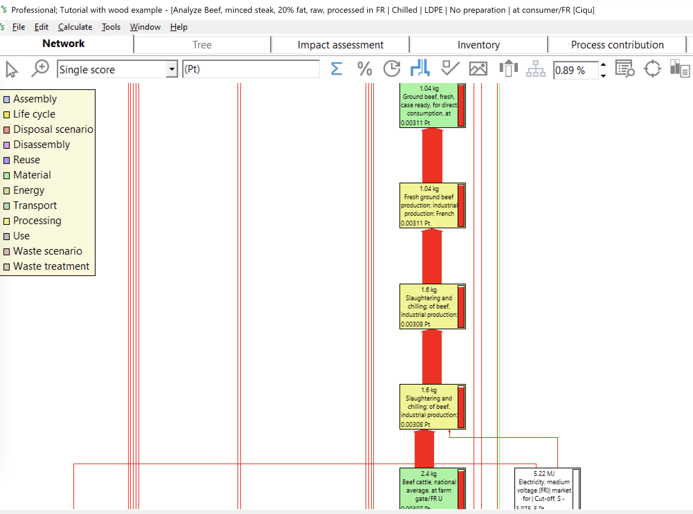

# 🐄 Boeuf haché


**Page en construction**


## Construction de l'ingrédient viande de boeuf hachée à partir du procédé agricole

La viande de bœuf hachée correspond à l'ICV suivant :&#x20;

* 'Ground beef, fresh, case ready, for direct consumption, at plant' (kilogram, FR, None)

$$
BoeufHacheREF
$$

Ce procédé est construit à partir du procédé :&#x20;

* Beef cattle, national average, at farm gate

$$
BoeufREF
$$

* de procédés d'abattage : &#x20;

<figure><figcaption></figcaption></figure>

On construit différents procédés de boeuf haché **(N)**, sur la base du procédé de référence ('Ground beef, fresh, case ready, for direct consumption, at plant' (kilogram, FR, None!), en appliquant les opérations d'abattage à différents procédés de boeuf **(N)**.

$$
ImpactBoeufHache_N = (ImpactBoeufHacheREF - ImpactBoeufREF )+ImpactBoeuf_N
$$

##

## Procédés retenus

| Label / Origine        | France                                                                                                                                                                                                   | Autres pays                                                                                                                                                                             |
| ---------------------- | -------------------------------------------------------------------------------------------------------------------------------------------------------------------------------------------------------- | --------------------------------------------------------------------------------------------------------------------------------------------------------------------------------------- |
| Conventionnelle        | 
<strong>BoeufHacheREF</strong> <strong></strong>'Ground beef, fresh, case ready, for direct consumption, at plant' (kilogram, FR, None) Boeuf : Beef cattle, national average, at farm gate
 | 
<strong>BoeufHacheREF</strong> 'Ground beef, fresh, case ready, for direct consumption, at plant' (kilogram, FR, None) Boeuf : Beef cattle, national average, at farm gate
 |
| Agriculture biologique | 
<strong>BoeufHacheBio</strong> Procédé construit (cf. formule) Boeuf : Cull cow, organic, milk system n°4, at farm gate
                                                                     | 
<strong>BoeufHacheBio</strong> Procédé construit (cf. formule) Boeuf : Cull cow, organic, milk system n°4, at farm gate
                                                    |


Le boeuf bio considéré dans un premier temps pour le calcul de la viande de boeuf hachée bio est celui dont l'impact est proche de l'impact moyen des vaches de réforme bio&#x20;


***

Cull cow, organic, milk system n°1, at farm gate

Cull cow, organic, milk system n°2, at farm gate

Cull cow, organic, milk system n°3, at farm gate

Cull cow, organic, milk system n°4, at farm gate

Cull cow, organic, milk system n°5, at farm gate

Cull cow, organic, lowland milk system, silage maize 5 to 10%, at farm gate

<figure><figcaption></figcaption></figure>

## Identification de l'origine par défaut

Pour déterminer l'origine d'un ingrédient par défaut, chaque ingrédient est classé dans l'une des 4 catégories suivantes :&#x20;

1. Ingrédient très majoritairement produit en France (> 95%) => origine par défaut : FRANCE
2. Ingrédient très majoritairement produit en Europe/Maghreb (>95%) => transport par défaut : EUROPE/MAGHREB&#x20;
3. Ingrédient produit également hors Europe (> 5%) => transport par défaut : PAYS TIERS
4. Ingrédient spécifique (ex. Haricots et Mangues)&#x20;

**Viande bovine => catégorie 2 : EUROPE/MAGHREB** (source : FranceAgrimer) ****&#x20;
