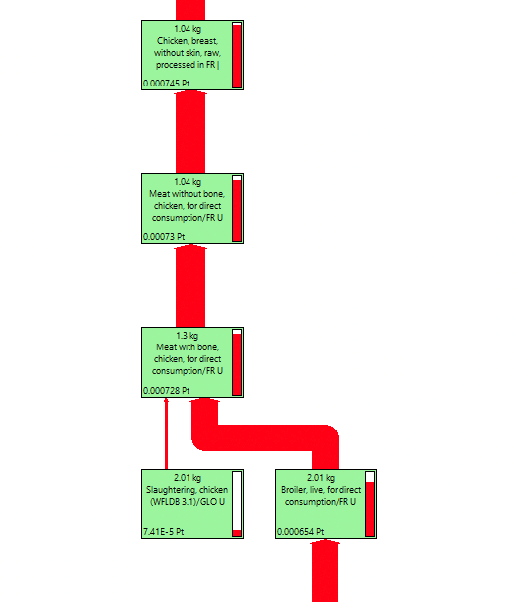

# 🐣 Poulet


**Page en construction**


## Construction de l'ingrédient jambon à partir du procédé agricole

Le jambon correspond à l'ICV suivant :&#x20;

* Chicken, breast, without skin, raw, processed in FR |

$$
BlancPouletREF
$$

Ce procédé est construit à partir du procédé :&#x20;

* Broiler, conventional, at farm gate

$$
PouletREF
$$

* de procédés intermédiaires (abattage, desossage) :

<figure><figcaption></figcaption></figure>

<figure><figcaption></figcaption></figure>

On construit différents procédés de blanc de poulet **(N)**, sur la base du procédé de référence (Chicken, breast, without skin, raw, processed in FR |), en appliquant les opérations intermédiaires à différents procédés de poulet sortie de ferme **(N)**.

$$
ImpactBlancPoulet_N = (ImpactBlancPouletREF - ImpactPouletREF )+ImpactPoulet_N
$$

## Procédés retenus

| Label / Origine        | France                                                                                                                                                           | Autres pays                                                                                                                                                      |
| ---------------------- | ---------------------------------------------------------------------------------------------------------------------------------------------------------------- | ---------------------------------------------------------------------------------------------------------------------------------------------------------------- |
| Conventionnelle        | 
<strong>BlancPouletREF</strong> <strong></strong>Chicken, breast, without skin, raw, processed in FR | Poulet : Broiler, conventional, at farm gate
 | 
<strong>BlancPouletREF</strong> <strong></strong>Chicken, breast, without skin, raw, processed in FR | Poulet : Broiler, conventional, at farm gate
 |
| Agriculture biologique | 
<strong>BlancPouletBio</strong> Procédé construit (cf. formule) Poulet : 
                                                                           | 
<strong>BlancPouletBio</strong> Procédé construit (cf. formule) Poulet : 
                                                                           |


Le poulet bio considéré dans un premier temps pour le calcul du blanc de poulet bio est celui dont l'impact est proche de l'impact moyen des poulets bio listés ci-dessous


Broiler, organic, at farm gate

Broiler, organic, system n°1, at farm gate

Broiler, organic, system n°2, at farm gate

(attente des graphes d'impacts)

_<mark style="color:red;">\[Intégration d'un graphique comparant les scores PEF décomposés des deux Farines qui seraient considérées]</mark>_&#x20;

