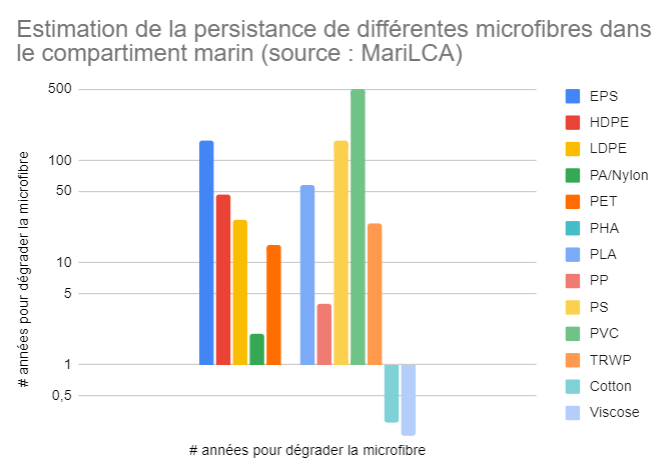

# 🌍 Biodiversité x Bois

## Contexte

Ce complément est introduit afin d'intégrer dans le coût environnemental des meubles l'impact sur la biodiversité de pratiques forestières participant à la dégradation des forêts.&#x20;

De manière plus précise, trois raisons expliquent la nécessité de proposer ce complément :&#x20;

<strong>1)  Le cadre méthodologique ACV est limité</strong>

Le cadre de l'analyse de cycle de vie (ACV) ne permet pas, à date, de différencier l'impact sur la biodiversité de différentes pratiques forestières. La biodiversité est difficilement quantifiable avec les indicateurs existants (16 indicateurs PEF) tandis que peu de données précises existent sur les différentes filières de production de bois d'ameublement.

2) L'importance des pratiques forestières 

La dégradation et la déforestation des forêts progressent à une vitesse alarmante à travers le monde. La [FAO ](#user-content-fn-1)[^1]estime que 420 millions d’hectares de forêts (c. 10 % des forêts existantes = superficie plus vaste que l’Union européenne) ont disparu dans le monde entre 1990 et 2020.

La déforestation et la dégradation des forêts sont également des facteurs importants du réchauffement climatique et de la perte de biodiversité, les deux défis environnementaux les plus importants de notre époque.

_Source : Règlement européen du 31 mai 2023 relatif à la déforestation importée_&#x20;

3) <strong>Le marché français : un débouché clé pour les filières bois</strong> 

Plusieurs secteurs d'activité français (ameublement, construction, jouets, etc.) constituent un débouché pour les filières bois.&#x20;

L'Ameublement est un contributeur significatif de la consommation française de bois. Tout bois utilisé sur ce secteur peut provenir de forêts participant à leur dégradation ("gestion intensive"). Concernant la déforestation, quelques approvisionnements en bois d'ameublement peuvent être concernés. Cependant, il est à noter que le secteur de l'ameublement participe peu à la déforestation à l'échelle mondiale (90% de cette dernière provenant de l'expansion de l'agriculture / source[^2]).


Le bois fait partie des quelques produits de base consommés au sein de l'UE et participant à la déforestation. Il se classe 3ème (9% de la déforestation dont l'UE est responsable provient du bois) après l'huile de plame (34%) et le soja (33%)

_Source : Règlement européen du 31 mai 2023 relatif à la déforestation importée_&#x20;


## Méthodes de calcul

$$
Comp =  \sum Ref(i) * Compo(i) * masse
$$

Avec :&#x20;

* `Comp` = l'impact environnemental du complément, exprimé en Pt d'impacts
* `Ref(i)` = l'impact biodiversité de chaque bois (`i`), exprimé en Pt d'impacts / kg&#x20;
* `Compo(i)` = la part du bois (`i`) entrant dans la composition du meuble, exprimée en % de `masse`
* `masse` = la masse du meuble, exprimée en kg&#x20;

## Paramètres&#x20;

### Ref (i) ⇒ Impact biodiversité de chaque bois (i)

#### **Etape 1 = Cartographie des bois d'ameublement (i)**     &#x20;

Les principales filières d'approvisionnement bois du marché français de l'ameublement ont été identifiées.&#x20;


1 filière d'approvisionnement = 1 bois = (i) = 1 essence (ex : chêne) + 1 origine (ex : France). &#x20;


Ces filières sont listées dans la prochaine section et sont spéficiques à un bois (i).

Plus d'info sur les filières d'approvisionnement

La majorité du bois d'ameublement est importé (c. 67% du volume consommé en 2019).

Parmi ces importations :&#x20;

* près de la moitié concernent des achats directs de meubles,
* près d'un-tiers concernent des panneaux,
* le reste étant du bois d'oeuvre (majoritairement feuillus)

:bulb: Remonter à l'origine de la forêt pour les bois d'ameublement est ainsi difficile pour la majorité des metteurs sur le marché. Dès lors, proposer des scénarios par défaut est nécessaire afin de refléter les enjeux biodiversité spécifiques à chaque bois.&#x20;

 (4).png>)

Principales sources utilisées pour ces statistiques :&#x20;

* Etude Carbone 4 \_ [Scénario de convergence de filière](https://www.carbone4.com/article-scenario-carbone-foret-bois) (Décembre 2023)
* Données de la filère Bois-Ameublement

#### **Etape 2 = Définition des valeurs de référence (Ref) pour chaque bois (i)**      &#x20;

L'impact biodiversité (Ref) de chaque bois (i) est calculé à partir de deux paramètres :&#x20;

* un coefficient de Gestion forestière (GF), exprimé en Pts d'impacts / kg
* &#x20;un Indice de corruption (IC), exprimé en %&#x20;

Coefficient de Gestion Forestière (GF)

Ce paramètre caractérise le mode de gestion forestière de chaque bois (i) entrant dans la composition du meuble.&#x20;

3 mode de gestion forestière sont proposés :&#x20;

* Intensive = 10 Pts d'impact / kg de bois
* Mitigée = 5 Pts d'impact / kg de bois
* Raisonnée = 0 Pts d'impact / kg de bois


**Focus \_ Gestion Forestière (GF)**

Pour chaque filière d'approvisionnement proposée (ex : Bois tropical \_ Asie du Sud-Est), le mode de gestion forestière (Intensive / Mitigée / Raisonnée) appliqué par défaut est basé sur une hypothèse majorant&#x65;_._ L'utilisation d'une telle hypothèse pénalisante, couplée à la possibilité de préciser ce scénario, permet de prendre en compte les pratiques vertueuses (ex : traçabilité jusqu'à la parcelle, utilisation de label, etc.)  tout en incitant à plus de traçabilité.&#x20;

Les valeurs par défaut se basent sur l'état de l'art compilé par Ecobalyse dans le cadre des travaux menés sur le premier semestre 2025. Concrètement, le mode de gestion forestière appliqué par défaut vise à distinguer les pratiques intensives (ex : forêts de plantation) de pratiques raisonnées (ex : futaire irrégulière). Un lien direct existe entre le mode de gestion forestière et la biodiversité au sein de tous les compartiments de l'ecosystème. &#x20;

Les principales sources utilisées pour estimer ces paramètre par origine sont :&#x20;

* des outils d'imagerie satellitaire permettant d'identifier les régions sylvicoles proposant une exploitation intensive des forêts ([carte 1](https://gfw.global/4kZ6RaB) de gains et pertes de couvert forestier entre 2000 et 2020 / [carte 2](https://gfw.global/41N4ujO) présentant les forêts de plantation),
* des ressources bibliographiques permettant de mieux comprendre les régions sylvicoles à risque concernant leur gestion des forêts,
* des entretiens et ateliers avec les filières Ameublement et Bois/Forêt (ex : atelier Sylviculture du 30/01/2025; support accessible [ici](https://miro.com/app/board/uXjVLn9pEjg=/?share_link_id=467200481479)).


Indice Corruption (IC) 

Ce paramètre vise pénaliser les pratiques forestières considérées pour chaque bois selon le niveau de corruption du pays. Ce paramètre est donc spécifique à une origine (pays ou région).

Plus le niveau de corruption est élevée, plus faible est la probabilité que le bois soit issu d'une forêt gérée durablement. Le niveau de corruption est estimé grâce au _Corruption Perception Index (score CPI)_ développé par Transparency International (cf. ci-dessous).

3 niveaux de corruption sont proposés :&#x20;

* Elevé (score CPI inférieur à 30)

- Moyen (score CPI entre 30 et 59)

* Faible (score CP au moins égal à 60)

Pour chaque niveau, un **coefficient de corruption (COR)** est appliqué; ce dernier vient préciser l'impact Biodiversité (BIO) du bois :&#x20;

| Elevé                                | Moyen                                | Faible                             |
| ------------------------------------ | ------------------------------------ | ---------------------------------- |
| <mark style="color:red;">+50%</mark> | <mark style="color:red;">+25%</mark> | <mark style="color:red;">0%</mark> |

**Détails**

Cet indice est basé sur le [Corruption Perceptions Index](https://www.transparency.org/en/cpi/2023) (CPI) de l'année 2023.&#x20;

Le CPI vise à mesurer les niveaux de corruption perçus dans le secteur public à travers le monde. Cet indice annuel est publié par Transparency International, une organisation non gouvernementale qui lutte contre la corruption.\
L'indice est basé sur des enquêtes et des évaluations d'experts qui portent sur divers aspects de la corruption, tels que l'abus de pouvoir public à des fins privées, les pots-de-vin, et la détournement de fonds publics.\
Les pays sont notés sur une échelle de 0 à 100, où 0 signifie un niveau de corruption perçu très élevé et 100 signifie un niveau très faible.

<figure><figcaption>
Impact biodiversité des différents bois proposés dans le Niveau 1 de la méthode ( Ref(i) )
</figcaption></figure>


Afin de couvrir toutes les configurations possibles, deux scénarios non spécifiques à une origine ont été intégrés dans la méthode :&#x20;

* **Origine inconnue** : lorsque l'utilisateur ne connaît pas l'origine de la forêt ayant produit le bois, l'origine "Inconnue" est proposée . Ce scénario présente des hypothèses majorantes afin d'inciter à plus de traçabilité.&#x20;
* **Autre origine** : Lorsque l'origine du bois à modéliser n'est pas proposée, le scénario "Autre" est à utiliser. Ce scénario reflète le fait qu'un bois ne serait pas concerné par une filière d'approvisionnement à risque d'un point de vue biodiversité (car les filières à risque sont listées dans les scénarios par défaut). Dès lors, seul le mode de gestion forestière (GF) se voit attribué une valeur moyenne (Mitigée) car des pratiques forestières intensives peuvent avoir lieu dans n'importe quel pays.


<mark style="color:orange;">Certifications / Label (optionnel / à creuser)</mark>

Une piste envisagée est d'utiliser des certifications afin de valoriser des pratiques durables d'un point de vue gestion forestière <⇒ biodiversité. Une telle prise en compte se matérialiserait par une réduction de <mark style="color:red;">x%</mark> du coefficient GF (Gestion forestière).&#x20;

Les deux principaux labels utilisés sur le marché de l'ameublement sont FSC et PEFC.&#x20;

Nous étudions actuellement la fiabilité et la pertinence de ces derniers par rapport à l'objectif de ce complément.

## Exemple d'application

<mark style="color:red;">A compléter</mark>

[^1]: L’Organisation des Nations unies pour l’alimentation et l’agriculture

[^2]: _Source : Règlement européen du 31 mai 2023 relatif à la déforestation importée_&#x20;
