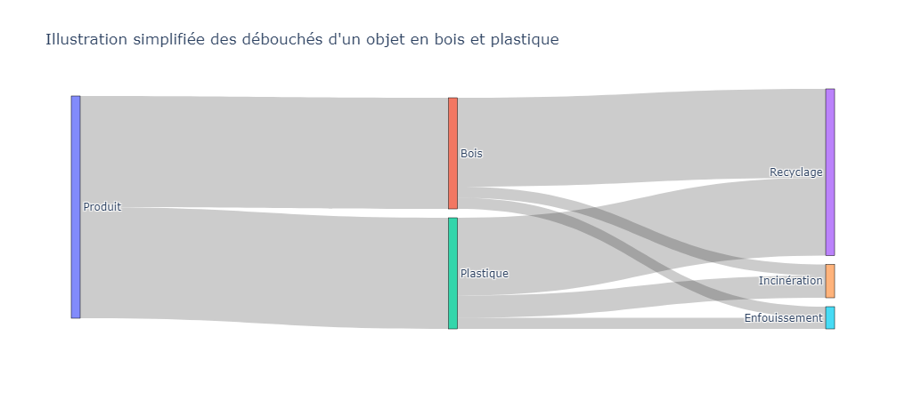

# Etape 4 : Fin de vie

## Contexte &#x20;

Evaluer le coût environnemental de la fin de vie d'un meuble consiste à calculer l'impact environnemental des débouchés du meuble.&#x20;

<figure><figcaption></figcaption></figure>

## Méthode de calcul

Le calcul de l'impact de la fin de vie d'un meuble se fait en trois temps :&#x20;

1. Définir la recyclabilité du meuble,
2. Définir les scénarios de fin de vie du produit,
3. calculer l'impact de ces scénarios.

### Etape 1 = Définir la recyclabilité du produit

Un meuble peut être :&#x20;

* recyclable
* non recyclable

Définir la recyclabilité du produit revient à comprendre les règles applicables tout au long de la filière de fin de vie du produit. Ces règles sont souvent spécifiques à chaque secteur d'activité (ex : la filière de fin de vie de véhicules thermiques est structurée différement de celle d'éléments d'ameublement).&#x20;

### Etape 2 = Définir les scénarios de fin de vie du produit

Les scénarios de fin de vie d'un produit peuvent être définis avec ces deux critères :&#x20;

* la recyclabilité du produit (oui vs non),
* la capacité de la filière à collecter le produit en fin de vie (taux de collecte),

<figure><figcaption></figcaption></figure>

### Etape 3 = Calculer l'impact de la fin de vie&#x20;



$$
FDV = ImpactCollecté+ ImpactNonCollecté
$$



$$
ImpactCollecté = ImpactRecyclable + ImpactNonRecyclable
$$

$$
ImpactNonCollecté = ImpactScénarioDéchet
$$



$$
ImpactRecyclable =  \sum (i)  M* (Enf(i)*Ienf(i) + Inc(i)*Iinc(i) + Recy(i) *Irec(i))
$$

$$
ImpactNonRecyclable = ImpactScénario Déchet = M * (Inc*Iinc + Enf*Ienf)
$$


Liste des variables mobilisées dans les formules ci-dessus :&#x20;

* M = kg = la masse de la partie du meuble spécifique au scénario modélisé &#x20;
* Enf(i) = % = la performance d'enfouissement du matériau (i) lorsque le meuble est collecté et recyclable\*
* Inc(i) = % = la performance d'incinération du matériau (i) lorsque le meuble est collecté et recyclable\*
* Rec(i) = % = la performance de recyclage du matériau (i) lorsque le meuble est collecté et recyclable\*
* Ienf(i) / Iinc(i) / Irec(i) = l'impact du procédé enfouissement/incinération/recyclage du matériau (i)
* Inc / Enf = % = scénario par défaut de Incinération et Enfouissement
* Iinc / Ienf = Pt / kg = coût environnemental des procédés par défaut Incinération et Enfouissement




## Paramètres retenus pour les meubles&#x20;

### Recyclabilité&#x20;

Deux  paramètres permettant de définir si un meuble est recyclable :&#x20;

#### **L'existence d'un schéma opérationnel**&#x20;

Ce paramètre reflète l'existence d'une filière de fin de vie permettant d'orienter chaque matière du meuble collecté vers leurs débouchés spécifiques (enfouissement, incinération, recyclage). L'abscence de schéma opérationnel implique l'impossibilité pour le meuble collecté d'être recyclé car il n'existe pas de schéma opérationnel permettant de collecter, séparer et recycler à l’échelle et en pratique les matières qui composent l’élément d’ameublement.&#x20;

Les catégories de meubles suivantes ne disposent pas de schéma opérationnel :&#x20;

* Décoration textile,
* Rembourrés d'assise et de couchage,
* Autres meubles rembourrés (ex : canapé, sommiers tappissiers)


Cette liste reflète l'état de la filière à un instant T.&#x20;

L'organisme coordinateur de la filière (l'OCABJ) se charge de s'assurer que la liste des éléments d'ameublement ne disposant pas de schéma opérationnel est à jour.&#x20;


#### **La présence d'au moins un facteur limitant** &#x20;

Les facteurs limitants identifient des éléments empêchant la capacité d'un meuble à être orienté vers les filières de recyclable spécifiques à ses composants/matières.&#x20;

Les facteurs limitants dans l'ameublement regroupent deux paramètres :&#x20;

* la présence de perturbateur de tri ou de recyclage\
  Certaines substances, matières ou associations de matériaux peuvent perturber le tri ou le recyclage des éléments d’ameublement. De plus, ces perturbateurs peuvent s’appliquent à (i) tous  types d’élément d’ameublement ou (ii) sont spécifiques à certains.\
  Si au moins un perturbateur de recyclage est présent, le meuble est considéré comme "Non Recyclable".
* L'absence de matériau majoritaire\
  Selon les éléments d'ameublement (ex : chaise, table, etc.), un seuil de "matériaux majoritaires" est à atteindre afin que le meuble soit orienté vers les filières de fin de vie spécifiques à chaque meuble.


Il est de la responsabilité de l'utilisateur de préciser la présence ou non de facteurs limitants.

La liste détaillée des facteurs limitant la recyclabilité du meuble est tenue à jour par l'organisme coordinateur de la filière REP des éléments d'ameublement : l'OCABJ[^1].&#x20;

Par défaut, le meuble est considéré avec au moins un facteur limitant (meuble non recyclable).

L'utilisateur a la possibilité de modifier ce paramètre.


### Taux de collecte `TC`

Pour l'Ameublement, un taux de collecte de 70% est appliqué par défaut pour l'ensemble des meubles. Cette valeur se base sur les tonnes collectés en fin de vie par la filière REP des éléments d'ameublement (1,2m en 2022) et les tonnes mises sur le marché comparables (c. 1,8m).&#x20;

Approfondir le taux de collecte

Le taux de collecte de 70% correspond au ratio entre les tonnes collectées (1,2m) et celles mises sur le marché pour renouveler le parx existant (1,8m) :&#x20;


Source :  scénario de fin de vie d'un meuble non recyclable / référentiel _Meubles Meublants (FCBA x ADEME)_


* 1,8 millions de tonnes de meubles mises sur le marché afin de renouveler le parc existant,
* 1,2 millions de tonnes collectées par la filière en fin de vie. &#x20;

_**Focus : Mises sur le marché**_

Les rapports annuels de la filière proposent des mises sur le marché annuelles incluant les meubles destinés à renouveller le parc existant (renouvellement) ainsi que les meubles destinés à de nouveaux usages/périmètres. Ces nouveaux usages sont triples : construction neuve, solde démographique en hausse, taux d'équipement en hausse).&#x20;

En 2022, 3 millions de tonnes ont été mises sur le marché (source : Filière des éléments d'ameublement _Données 2023_ Bilan annuel). Suite à des entretiens avec la filière, nous estimons que 40% (1,2 millions de tonnes) des mises sur le marché correspondent à des nouveaux usages.&#x20;

_**Focus : Tonnes collectées**_

En 2022, 1,2 millions de tonnes ont été collectées par la filière; que ce soit via des déchetteries gérées opérationnellement par la filière ou des déchetteries soutenues financièrement (source : Filière des éléments d'ameublement _Données 2023_ Bilan annuel).&#x20;

### Scénarios Déchet

Ce scénario est applicable aux matériaux non collectés et aux matériaux collectés mais non recyclables.

### &#x20;`Inc` `Iinc` &#x20;

<table><thead><tr><th width="267">Matière</th><th>% recyclage</th><th>Inc (% incinération) </th><th>Enf (% enfouissement)</th></tr></thead><tbody><tr><td>Toutes</td><td>n/a</td><td>82%</td><td>18%</td></tr></tbody></table>

`Ienf` = Treatment of municipal solid waste, sanitary landfill, RoW = 21 Pt / kg

`Iinc` = Treatment of municipal solid waste, municipal incineration, FR = 39 Pt / kg


Ce scénario est basé sur le scénario de fin de vie d'un mobilier meublant dont la recyclabilité du meuble est de 0% dans la dernière version du référentiel BPX30 _Meubles Meublants \_ FCBA (Novembre 2023)_


### Scénarios spécifiques à chaque matière&#x20;

### `Rec(i)`  `Inc(i)`  `Enf(i)`&#x20;

<table><thead><tr><th width="267">Matériau (i)</th><th>Rec(i)</th><th>Inc(i)</th><th>Enf(i)</th></tr></thead><tbody><tr><td>Bois (massif &#x26; panneaux)*</td><td>69%</td><td>31</td><td>0%</td></tr><tr><td>Métal*</td><td>100%</td><td>0%</td><td>0%</td></tr><tr><td>Rembourré/Matelas/Mousse*</td><td>4%</td><td>94%</td><td>2%</td></tr><tr><td>Plastique*</td><td>92%</td><td>8%</td><td>0%</td></tr><tr><td>Emballage (carton)**</td><td>85%</td><td>11%</td><td>4%</td></tr><tr><td>Emballage (plastique)**</td><td>7%</td><td>68%</td><td>25%</td></tr><tr><td>Emballage (autres)**</td><td>0%</td><td>73%</td><td>27%</td></tr><tr><td>Autres matières</td><td>0%</td><td>82%</td><td>18%</td></tr></tbody></table>

&#x20;   \*Source : Filière REP EA _données 2022 (Bilan annuel 2023)_\
&#x20; _\*\*Source : Référentiel Mobilier Meublant  \__ scénarios emballages (FCBA-ADEME)


<mark style="color:red;">Liste à compléter/préciser (ex : latex, Mousse PU, etc.) = attente de retours précis de la filière</mark>


### `Irec(i)`  `Iinc(i)`  `Ienf(i)`&#x20;

#### Liste des procédés

6 procédés sont utilisés pour modéliser le coût environnemental de la fin de vie des meubles.  &#x20;

<table data-full-width="false"><thead><tr><th width="113.6666259765625">Matériau (i)</th><th width="166.66656494140625">Recyclage</th><th>Incinération</th><th>Enfouissement</th></tr></thead><tbody><tr><td>Bois (massif &#x26; panneaux)</td><td>n/a (cut-off)</td><td>Treatment of waste wood, untreated, municipal incineration, CH</td><td>n/a</td></tr><tr><td>Métal</td><td>n/a (cut-off)</td><td>n/a</td><td>n/a</td></tr><tr><td>Rembourré / Matelas</td><td>n/a (cut-off)</td><td>Treatment of waste polyurethane, municipal incineration FAE, CH</td><td>Treatment of municipal solid waste, sanitary landfill, RoW</td></tr><tr><td>Plastique</td><td>n/a (cut-off)</td><td>Treatment of waste plastic, mixture, municipal incineration, Europe (without CH)</td><td>n/a</td></tr><tr><td>Emballage (carton)</td><td>n/a (cut-off)</td><td>Treatment of waste paperboard, municipal incineration, Europe (without CH)</td><td>Treatment of municipal solid waste, sanitary landfill, RoW</td></tr><tr><td>Emballage (plastique)</td><td>n/a (cut-off)</td><td>Treatment of waste plastic, mixture, municipal incineration, Europe (without CH)</td><td>Treatment of municipal solid waste, sanitary landfill, RoW</td></tr><tr><td>Emballage (autre)</td><td>n/a</td><td>Treatment of municipal solid waste, municipal incineration, FR</td><td>Treatment of municipal solid waste, sanitary landfill, RoW</td></tr><tr><td>Autres</td><td>n/a</td><td>Treatment of municipal solid waste, municipal incineration, FR</td><td>Treatment of municipal solid waste, sanitary landfill, RoW</td></tr></tbody></table>


**Recyclage = Impact nul (approche cut-off)**

Ecobalyse utilise l'approche cut-off pour allouer l'impact du recyclage des matériaux.

Dit autrement, l'impact du recyclage des matériaux est alloué 100% au produit utilisant ces matières recyclées. Ainsi, l'impact en fin de vie d'un meuble 100% recyclé serait nul.&#x20;


#### Coût environnemental (Pt d'impact / kg)&#x20;

<table><thead><tr><th width="267">Matériau (i)</th><th>Irec(i)</th><th>Iinc(i)</th><th>Ienf(i)</th></tr></thead><tbody><tr><td>Bois (massif &#x26; panneaux)*</td><td>0</td><td>2</td><td>n/a</td></tr><tr><td>Métal*</td><td>0</td><td>n/a</td><td>n/a</td></tr><tr><td>Rembourré/Matelas/Mousse*</td><td>0</td><td>96</td><td>39</td></tr><tr><td>Plastique*</td><td>0</td><td>80</td><td>39</td></tr><tr><td>Emballage (carton)**</td><td>0</td><td>7</td><td>39</td></tr><tr><td>Emballage (plastique)**</td><td>0</td><td>80</td><td>39</td></tr><tr><td>Emballage (autres)**</td><td>n/a</td><td>21</td><td>39</td></tr><tr><td>Autres matières</td><td>n/a</td><td>21</td><td>39</td></tr></tbody></table>

Vision simplifiée des procédés spécifiques mobilisés

<figure><figcaption></figcaption></figure>

<figure><figcaption></figcaption></figure>

## Exception


**Exception "Métal"**

Qu'un meuble soit recyclable ou non, les composants métalliques sont dans tous les cas triés et recyclés à 100%.


## Exemples&#x20;

<mark style="color:red;">A actualiser</mark>

[^1]: &#x20;L'organisme coordinateur de la filière de Responsabilité Elargie du Producteur des Eléments d'Ameublement.
