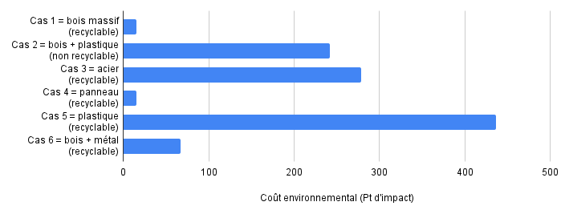

# Etape 4 : Fin de vie

## Contexte &#x20;

Définir les scénarios de fin de vie d'un meuble consiste à définir les débouchés de l'ensemble des matériaux entrant dans la composition du meuble.&#x20;

Illustration de la modélisation des scénarios de fin de vie d'un meuble&#x20;

<mark style="color:red;">(Intégrer Sankey Graphe afin d'illustrer)</mark>

3 débouchés sont proposés dans la méthode :&#x20;

* recyclage,
* incinération,
* enfouissement.

## Méthode de calcul

Le calcul de l'impact de la fin de vie d'un meuble se fait en deux temps :&#x20;

1. définir les scénarios de fin de vie du meuble,
2. calculer l'impact de ces scénarios.

### Etape 1 = Définir les scénarios de fin de vie du meuble

La définition des scénarios se fait en 3 étapes :&#x20;

#### 1) Taux de collecte&#x20;

Ce paramètre définit la capacité du meuble à être collécté en fin de vie.\
Un taux de collecte de 70% est appliqué par défaut pour l'ensemble des meubles. Cette valeur se base sur les tonnes collectés en fin de vie par la filière REP des éléments d'ameublement (1,2m en 2022) et les tonnes mises sur le marché comparables (c. 1,8m).&#x20;

Approfondir le taux de collecte de 70%

Le taux de collecte de 70% correspond au ratio entre les tonnes collectées (1,2m) et celles mises sur le marché pour renouveler le parx existant (1,8m) :&#x20;

* 1,8 millions de tonnes de meubles mises sur le marché afin de renouveler le parc existant,
* 1,2 millions de tonnes collectées par la filière en fin de vie. &#x20;

_**Focus : Mises sur le marché**_

Les rapports annuels de la filière proposent des mises sur le marché annuelles incluant les meubles destinés à renouveller le parc existant (renouvellement) ainsi que les meubles destinés à de nouveaux usages/périmètres. Ces nouveaux usages sont triples : construction neuve, solde démographique en hausse, taux d'équipement en hausse).&#x20;

En 2022, 3 millions de tonnes ont été mises sur le marché (source : Filière des éléments d'ameublement _Données 2023_ Bilan annuel). Suite à des entretiens avec la filière, nous estimons que 40% (1,2 millions de tonnes) des mises sur le marché correspondent à des nouveaux usages.&#x20;

_**Focus : Tonnes collectées**_

En 2022, 1,2 millions de tonnes ont été collectées par la filière; que ce soit via des déchetteries gérées opérationnellement par la filière ou des déchetteries soutenues financièrement (source : Filière des éléments d'ameublement _Données 2023_ Bilan annuel).&#x20;

Dès lors, 30% du meuble est orienté vers le scénario "Non Collecté" et 70% vers le scénario "Collecté" (plus de détails ci-après). &#x20;

#### 2) Schéma opérationnel&#x20;

Ce paramètre reflète l'existence d'une filière de fin de vie permettant d'orienter chaque matière du meuble collecté vers leurs débouchés spécifiques (enfouissement, incinération, recyclage).

L'abscence de schéma opérationnel implique l'impossibilité pour le meuble collecté d'être recyclé car il n'existe pas de schéma opérationnel permettant de collecter, séparer et recycler à l’échelle et en pratique les matières qui composent l’élément d’ameublement.&#x20;

#### 3) Facteurs limitants&#x20;

Les facteurs limitants regroupent deux types de paramètres empêchant la recyclabilité du meuble.&#x20;

* la présence de perturbateur de tri ou de recyclage\
  Certaines substances, matières ou associations de matériaux peuvent perturber le tri ou le recyclage des éléments d’ameublement. De plus, ces perturbateurs peuvent s’appliquent à (i) tous  types d’élément d’ameublement ou (ii) sont spécifiques à certains.\
  Si au moins un perturbateur de recyclage est présent, le meuble est considéré comme "Non Recyclable".
* L'absence de matériau majoritaire\
  Selon les éléments d'ameublement (ex : chaise, table, etc.), un seuil de "matériaux majoritaires" est à atteindre afin que le meuble soit orienté vers les filières de fin de vie spécifiques à chaque meuble.


**Exception "Métal"**

Qu'un meuble soit recyclable ou non, les composants métalliques sont dans tous les cas triés et recyclés à 100%.


#### &#x20;Dès lors, 3 scénarios de fin de vie sont possibles :&#x20;

* Scénario 1 = le meuble dispose d'un schéma opérationnel et ne présente pas de facteur limitant (meuble recyclable),
* Scénario 2 = le meuble dispose d'un schéma opérationnel et présente au moins un facteur limitant (meuble non recyclable),
* Scénario 3 = le meuble ne dispose pas de schéma opérationnel (meuble non recyclable).  &#x20;

### Etape 2 = Calculer l'impact de la fin de vie du meuble



$$
FDV = 0,3M*ImpactNonCollecté + 0,7M*ImpactCollecté
$$

Avec :&#x20;

$$
ImpactNonCollecté =  0,82 Ienf + 0,18Iinc
$$

$$
ImpactCollecté =   \sum (i) * (Enf(i)*Ienf(i) + Inc(i)*Iinc(i) + Recy(i) *Irec(ii))
$$




$$
FDV = ImpactNonCollecté
$$

$$
ImpactNonCollecté =  0,82 Ienf + 0,18Iinc
$$




Liste des variables mobilisées dans les formules ci-dessus :&#x20;

* M = la masse du meuble (kg),
* Ienf = impact du procédé enfouissement par défaut,
* Iinc = impact du procédé incinération par défaut,
* Enf(i) = % = la performance d'enfouissement du matériau (i) lorsque le meuble est collecté et recyclable\*
* Inc(i) = % = la performance d'incinération du matériau (i) lorsque le meuble est collecté et recyclable\*
* Rec(i) = % = la performance de recyclage du matériau (i) lorsque le meuble est collecté et recyclable\*
* Ienf(i) / Iinc(i) / Irec(i) = l'impact du procédé enfouissement/incinération/recyclage du matériau (i)


## Paramètres retenus pour le calcul du coût environnemetnal&#x20;

### Performances des matériaux lorsque le meuble est collecté et recyclable&#x20;

<table><thead><tr><th width="267">Matière</th><th>% recyclage</th><th>% incinération</th><th>% enfouissement</th></tr></thead><tbody><tr><td>Bois d'oeuvre*</td><td>69%</td><td>31</td><td>0%</td></tr><tr><td>Métal*</td><td>100%</td><td>0%</td><td>0%</td></tr><tr><td>Rembourré/Matelas/Mousse*</td><td>2%</td><td>91%</td><td>7%</td></tr><tr><td>Plastique*</td><td>90%</td><td>10%</td><td>1%</td></tr><tr><td>Emballage (carton)**</td><td>85%</td><td>11%</td><td>4%</td></tr><tr><td>Emballage (plastique)**</td><td>7%</td><td>68%</td><td>25%</td></tr><tr><td>Emballage (autres)**</td><td>0%</td><td>73%</td><td>27%</td></tr><tr><td>Autres matières***</td><td>0%</td><td>82%</td><td>18%</td></tr><tr><td><mark style="color:red;">Liste à compléter/précier (ex : latex, Mousse PU, etc.)</mark></td><td><mark style="color:red;">xx</mark></td><td><mark style="color:red;">xx</mark></td><td><mark style="color:red;">xx</mark></td></tr></tbody></table>

&#x20;   \*Source : Filière des éléments d'ameublement \_ données 2021 (Bilan annuel 2022)\
&#x20; \*\*Source : Référentiel Meubles meublants révisé en 2023 (FCBA-ADEME)\
\*\*\*Application du scénario par défaut "Meuble non recyclable"

### Schémas opérationnels&#x20;

Les catégories de meubles suivantes ne disposent pas de schéma opérationnel :&#x20;

* Décoration textile,
* Rembourrés d'assise et de couchage,
* Autres meubles rembourrés (ex : canapé, sommiers tappissiers)


Cette liste reflète l'état de la filière à un instant T.&#x20;

L'organisme coordinateur de la filière (l'OCABJ) se charge de s'assurer que la liste des éléments d'ameublement ne disposant pas de schéma opérationnel est à jour.&#x20;


### Fin de vie des des meubles non recyclables&#x20;

Lorsqu'un meuble est non recyclable (cf. scénarios 2 et 3 ci-dessus), ce dernier est incinéré à 82% et enfoui à 18%.


Ce scénario est basé sur le scénario de fin de vie d'un mobilier meublant dont la recyclabilité du meuble est de 0% dans la dernière version du référentiel BPX30 _Meubles Meublants \_ FCBA (Novembre 2023)_



Le scénario 2 (meuble non recyclable car présence d'au moins un facteur limitant) pourrait être précisé car ce scénario implique généralement l'envoi du meuble vers une filière [CSR ](#user-content-fn-1)[^1]\(incinération avec récupération de chaleur).


### Facteurs limitants

Les facteurs limitants sont spécifiques à chaque catégorie de meubles (canapé, table, etc.). Il est de la responsabilité de l'utilisateur de préciser la présence ou non de facteurs limitants.

Par défaut, la modélisation d'un meuble dans Ecobalyse intègre la présence d'au moins un facteur limitant.


La liste détaillée des facteurs limitant la recyclabilité du meuble est tenue à jour par l'organisme coordinateur de la filière REP des éléments d'ameublement : l'OCABJ[^2].&#x20;

Par défaut, le meuble est considéré avec un perturbateur de recyclage (meuble non recyclable).

L'utilisateur a la possibilité de modifier ce paramètre.


## Procédés utilisés pour le coût environnemental&#x20;

Pour chaque débouché, au moins un procédé par défaut t est proposé (ex : procédé "Treatment of municipal solid waste, sanitary landfill, RoW" pour le débouché "Enfouissement").&#x20;

Pour certains types de matière (ex : plastique), des procédés spécifiques sont disponibles (ex : procédé "Polyethylene production, high density, granulate, recycled, US" pour le recyclage du plastique).&#x20;

#### Liste des procédés par type de matière

<table data-full-width="false"><thead><tr><th width="113.6666259765625">Type de matière</th><th width="166.66656494140625">Recyclage</th><th>Incinération</th><th>Enfouissement</th></tr></thead><tbody><tr><td>Bois (massif &#x26; panneaux)</td><td>Treatment of waste wood, post-consumer, sorting and shredding, CH</td><td>Treatment of waste wood, untreated, municipal incineration, CH</td><td>Treatment of waste wood, untreated, sanitary landfill, RoW</td></tr><tr><td>Métal</td><td>Treatment of aluminium scrap, post-consumer, by collecting, sorting, cleaning, pressing, RER</td><td>Treatment of municipal solid waste, sanitary landfill, RoW</td><td>Treatment of municipal solid waste, sanitary landfill, RoW</td></tr><tr><td>Rembourré / Matelas</td><td>Ttreatment of waste polyurethane, municipal incineration FAE, CH</td><td>Treatment of waste polyurethane, municipal incineration FAE, CH</td><td>Treatment of municipal solid waste, sanitary landfill, RoW</td></tr><tr><td>Plastique</td><td>Polyethylene production, high density, granulate, recycled, US</td><td>Treatment of waste plastic, mixture, municipal incineration, Europe (withou CH)</td><td>Treatment of waste plastic, mixture, sanitary landfill, RoW</td></tr><tr><td>Emballage (carton)</td><td>Containerboard production, fluting medium, recycled</td><td>Treatment of waste paperboard, municipal incineration, Europe (withou CH)</td><td>Treatment of waste paperboard, sanitary landfill, CH</td></tr><tr><td>Emballage (plastique)</td><td>Polyethylene production, high density, granulate, recycled, US</td><td>Treatment of waste plastic, mixture, municipal incineration, Europe (withou CH)</td><td>Treatment of waste plastic, mixture, sanitary landfill, RoW</td></tr><tr><td>Emballage (autre)</td><td>n/a</td><td>Treatment of municipal solid waste, municipal incineration, FR</td><td>Treatment of municipal solid waste, sanitary landfill, RoW</td></tr><tr><td>Autres</td><td>n/a</td><td>Treatment of municipal solid waste, municipal incineration, FR</td><td>Treatment of municipal solid waste, sanitary landfill, RoW</td></tr></tbody></table>

#### Coût environnemental (Pt d'impact / kg) des procédés (cf. ci-dessus)

| Type de matière          | Recyclage | Incinération | Enfouissement |
| ------------------------ | --------- | ------------ | ------------- |
| Bois (massif & panneaux) | 1         | 2            | 2             |
| Métal                    | 27        | 21           | 39            |
| Rembourré / Matelas      | 96        | 96           | 39            |
| Plastique                | 63        | 80           | 12            |
| Emballage (carton)       | 68        | 7            | 46            |
| Emballage (plastique)    | 63        | 80           | 12            |
| Emballage (autre)        | n/a       | 21           | 39            |
| Autres                   | n/a       | 21           | 39            |

## Exemples&#x20;

<mark style="color:red;">A actualiser</mark>

**Voici différentes configurations du coût environnemental de la fin de vie d'un meuble de 10kg  :**&#x20;

<figure><figcaption></figcaption></figure>


<mark style="color:orange;">Les ordres de grandeur sont à prendre avec du recul à ce stade car :</mark>&#x20;

* <mark style="color:orange;">l'impact d'un meuble peut se chiffre en plusieurs dizaines de milliers de points d'impacts (les impacts de fin de vie pouvant être considérés comme "non significatifs"),</mark>
* <mark style="color:orange;">des enrichissements vont être apportés à la méthode et aux procédés Ecoinvent mobilisés.</mark>


Cas 1 ⇒ 100% bois massif _ recyclable (15 pt d'impacts)

<figure><figcaption></figcaption></figure>

<figure><figcaption></figcaption></figure>

Cas 2 = 60% bois massif + 40% plastique _ non recyclable  (242 pt d'impact)

<figure><figcaption></figcaption></figure>

<figure><figcaption></figcaption></figure>

Cas 3 = 100% acier _ recyclable (278 pt d'impact)

<figure><figcaption></figcaption></figure>

<figure><figcaption></figcaption></figure>

Cas 4 = 100% panneau de particules _ recyclable (15 pt d'impact)

<figure><figcaption></figcaption></figure>

<figure><figcaption></figcaption></figure>

Cas 5 = 100% plastique _ recyclable (436 pt d'impact)

<figure><figcaption></figcaption></figure>

<figure><figcaption></figcaption></figure>

Cas 6 = 80% bois massif + 20% métal _ recyclable (67 pt d'impact)

<figure><figcaption></figcaption></figure>

<figure><figcaption></figcaption></figure>

[^1]: Combustibles solides de récupération

[^2]: &#x20;L'organisme coordinateur de la filière de Responsabilité Elargie du Producteur des Eléments d'Ameublement.
