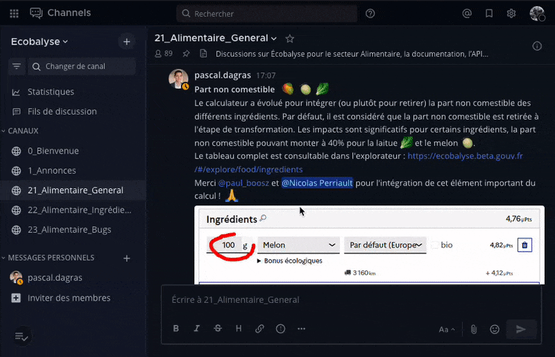

# 🤝 Communauté

**Ecobalyse propose aux acteurs des filières Alimentaire et Textile qui le souhaitent de rejoindre** [**son instance Mattermost**](https://chat.ecobalyse.fr) **afin de s'informer, échanger et participer à la co-construction de la méthodologie d'évaluation des impacts environnementaux.**

Toutes questions, contributions ou critiques constructives y sont bienvenues !


Pour participer, vous devez au préalable [créer un compte sur la plateforme](https://chat.ecobalyse.fr/signup_user_complete).


Une fois inscrit et connecté :

1. [**Présentez-vous sur le canal “0\_Bienvenue”**](https://chat.ecobalyse.fr/ecobalyse/channels/00_bienvenue) : en quelques mots, votre activité, organisation, intérêts pour l’affichage environnemental
2.  **Rejoignez les autres canaux de discussion :**

    * Pour le domaine **alimentaire** :
      * [21\_Alimentaire\_Concertation](https://chat.ecobalyse.fr/ecobalyse/channels/02_alimentaire_general) : pour tous les retours et questions relatifs à la méthode de calcul, aux données et au calculateur Écobalyse pour le secteur Alimentaire
      * [23\_Alimentaire\_Bugs](https://chat.ecobalyse.fr/ecobalyse/channels/02_alimentaire_bugs) : Remontez les bugs et erreurs sur le simulateur alimentaire.&#x20;
    * Pour le domaine **textile** :
      * [31\_Textile](https://chat.ecobalyse.fr/ecobalyse/channels/31_textile)[ (méthodologie)](https://chat.ecobalyse.fr/ecobalyse/channels/31_textile) : pour toutes les discussions sur Écobalyse pour le secteur Textile, la documentation, l’API… Ce canal remplace le Slack utilisé jusqu'ici.
      * [31\_Textile\_Niveau2](https://chat.ecobalyse.fr/ecobalyse/channels/31_textile_niveau2) : pour les échanges relatifs un "niveau 2" de paramétrage, c'est à dire la mobilisation de paramètres aujourd'hui non exposés dans le mode "réglementaire" d'Ecobalyse et, potentiellement, la mobilisation de données plus précises.
      * [32\_Textile (cadre\_réglementaire)](https://chat.ecobalyse.fr/ecobalyse/channels/32_textile-cadre_reglementaire) : pour les échanges relatifs au projet de cadre réglementaire présenté lors d'un webinaire le 4 décembre 2024. Attention : il ne s'agit pas de la plateforme officielle de la consultation ouverte jusqu'au 19 décembre 2024. Ce canal vise surtout à apporter des clarification sur des questions de compréhension.
    *   Pour le domaine **ameublement** :

        * [41\_Ameublement](https://chat.ecobalyse.fr/ecobalyse/channels/41_ameublement) : pour toutes les discussions sur Écobalyse pour le secteur Ameublement, la documentation, l’API…&#x20;

    

Pour rejoindre un canal, il suffit de s'y rendre en suivant les liens ci-dessus, ou alors d'utiliser le moteur de recherche de Mattermost pour les retrouver :   

