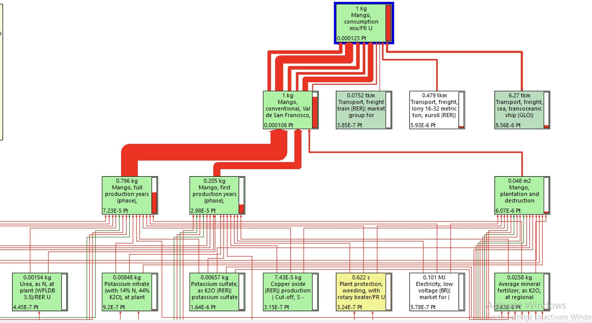

# 🥭 Mangue

## Choix de procédés

Considérée comme un ingrédient agricole (at farm), la mangue est modélisé à travers les procédés suivants :&#x20;

| Label / Origine        | France                                                                       | Autres pays                                                                  |
| ---------------------- | ---------------------------------------------------------------------------- | ---------------------------------------------------------------------------- |
| Conventionnelle        | 'Mango, conventional, Val de San Francisco, at orchard' (kilogram, BR, None) | 'Mango, conventional, Val de San Francisco, at orchard' (kilogram, BR, None) |
| Agriculture biologique | 'Mango, conventional, Val de San Francisco, at orchard' (kilogram, BR, None) | 'Mango, conventional, Val de San Francisco, at orchard' (kilogram, BR, None) |

Les procédés retenus sont des procédés "at farm", c'est à dire des procédés traduisant l'impact de l'ingrédient en sortie de ferme, avant que ne soit par exemple intégré l'impact du transport vers un lieu de transformation ou encore l'impact du conditionnement.

En effet, dans Agribalyse le mix de consommation appelle le procédé 'Mango, conventional, Val de San Francisco, at orchard' (kilogram, BR, None) :&#x20;

<figure><figcaption></figcaption></figure>

## Identification de l'origine par défaut

Pour déterminer l'origine d'un ingrédient par défaut, chaque ingrédient est classé dans l'une des 4 catégories suivantes :&#x20;

1. Ingrédient très majoritairement produit en France (> 95%) => origine par défaut : FRANCE
2. Ingrédient très majoritairement produit en Europe/Maghreb (>95%) => transport par défaut : EUROPE/MAGHREB&#x20;
3. Ingrédient produit également hors Europe (> 5%) => transport par défaut : PAYS TIERS
4. Ingrédient spécifique AVION (ex. Haricots et Mangues)&#x20;

**Mangue => catégorie 4 (ingrédient spécifique)**&#x20;

