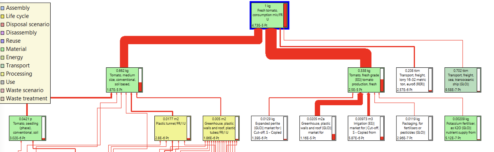

# 🍅 Tomate

## Tomato, medium size, conventional, soil based, non-heated greenhouse, at greenhouse {FR} UChoix de procédés

Considérée comme un ingrédient agricole (at farm), **la tomate** est modélisée à travers les procédés suivants :&#x20;

| Label / Origine             | France                                                                                        | Espagne                                                                                                                                                               | Autres pays                                                                                   |
| --------------------------- | --------------------------------------------------------------------------------------------- | --------------------------------------------------------------------------------------------------------------------------------------------------------------------- | --------------------------------------------------------------------------------------------- |
| Agriculture conventionnelle | Tomato, medium size, conventional, soil based, non-heated greenhouse, at greenhouse {FR} U    | 
A venir : 

Tomato, fresh grade {ES}| tomato production, fresh grade, in unheated greenhouse | Cut-off, U - Copied from Ecoinvent' (kilogram, None, None)
 | 
A venir : 

y défini par la formule ci-dessous
                                    |
| Agriculture biologique      | Tomato, organic, greenhouse production, national average, at greenhouse' (kilogram, FR, None) | Tomato, organic, greenhouse production, national average, at greenhouse' (kilogram, FR, None)                                                                         | Tomato, organic, greenhouse production, national average, at greenhouse' (kilogram, FR, None) |

## Analyse des procédés disponibles

La base Agribalyse permet de distinguer les inventaires de cycle de vie suivants.&#x20;

* **16 procédés** France "at farm" (at farm gate/at greenhouse) :&#x20;
  * Tomato, conventional, new closed glasshouse,  unavoidable energy and biomass, no liquid CO2, runoff recycling, at farm gate
  * Tomato, conventional, new closed glasshouse,  unavoidable energy and biomass, runoff recycling, at farm gate
  * Tomato, conventional, new glasshouse, biomass and natural gas, runoff recycling, at farm gate
  * Tomato, conventional, new glasshouse, natural gas, no runoff recycling, at farm gate
  * Tomato, conventional, new glasshouse, natural gas, no runoff recycling, with water footprint, at farm gate
  * Tomato, conventional, new glasshouse, natural gas, runoff recycling, at farm gate
  * Tomato, conventional, new glasshouse, natural gas, runoff recycling, with water footprint, at farm gate
  * Tomato, conventional, new glasshouse, unavoidable energy and natural gas, runoff recycling, at farm gate
  * Tomato, conventional, old glasshouse, natural gas, no runoff recycling, at farm gate
  * Tomato, average basket, conventional, heated greenhouse, national average, at greenhouse' (kilogram, FR, None)
  * Tomato, average basket, conventional, soil based, non-heated greenhouse, at greenhouse' (kilogram, FR, None)
  * Tomato, medium size, conventional, heated greenhouse, at greenhouse' (kilogram, FR, None)
  * _Tomato, medium size, conventional, soil based, non-heated greenhouse, at greenhouse' (kilogram, FR, None)_
  * **Tomato, organic, greenhouse production, national average, at greenhouse' (kilogram, FR, None)**
  * Tomato, production mix, greenhouse production, national average, at greenhouse' (kilogram, FR, None)
* 1 procédé ES :
  * _Tomato, fresh grade {ES}| tomato production, fresh grade, in unheated greenhouse | Cut-off, U - Copied from Ecoinvent' (kilogram, None, None)_
* Dont 3 moyennes nationales France dont la construction est explicitée dans le schéma ci-après
  * Tomato, average basket, conventional, heated greenhouse, national average, at greenhouse' (kilogram, FR, None)
  * **Tomato, organic, greenhouse production, national average, at greenhouse' (kilogram, FR, None)**
  * Tomato, production mix, greenhouse production, national average, at greenhouse' (kilogram, FR, None)


Pour la **tomate bio**, le procédé retenu est le procédé de la tomate bio "national average", ie Tomato, organic, greenhouse production, national average, at greenhouse' (kilogram, FR, None).


#### Axe de progrès :&#x20;

Pour les origines "autres pays", mobiliser pour :&#x20;

* La tomate espagnole : _Tomato, fresh grade {ES}| tomato production, fresh grade, in unheated greenhouse | Cut-off, U - Copied from Ecoinvent' (kilogram, None, None)_
* Les autres pays : le procédé mobilisé dans le consumption mix (cf. graphe ci-dessous), calculé par la formule :&#x20;

$$
y = 0,662*x1 + 0,338*x2
$$


On remarque d'après l'analyse d'impacts ci-dessous que la tomate ES est moins impactante que la tomate FR conventionnelle (et il en est de même pour la tomate "autres pays")


#### Mix de consommation

Le procédé "Fresh tomato, consumption mix" France proposée dans Agribalyse s'appuie sur les procédés suivants.

On observe 2 ICV "autres pays" mobilisés.

<figure><figcaption></figcaption></figure>

## Identification de l'origine par défaut

Pour déterminer l'origine d'un ingrédient par défaut, chaque ingrédient est classé dans l'une des 4 catégories suivantes :&#x20;

1. Ingrédient très majoritairement produit en France (> 95%) => origine par défaut : FRANCE
2. Ingrédient très majoritairement produit en Europe/Maghreb (>95%) => transport par défaut : EUROPE/MAGHREB&#x20;
3. Ingrédient produit également hors Europe (> 5%) => transport par défaut : PAYS TIERS
4. Ingrédient spécifique (ex. Haricots et Mangues)&#x20;

**Tomate => catégorie 3 : EUROPE/MAGHREB** (source : FranceAgriMer/dires d'experts)&#x20;
