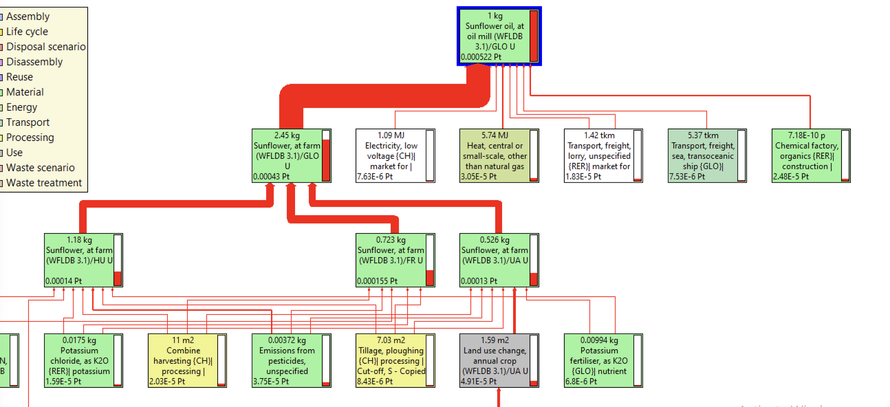

# 🌻 Huile de tournesol

## Construction de l'ingrédient industrie à partir d'ingrédients agricoles

Le procédé proposé dans Agribalyse pour l'huile de tournesol est :&#x20;

* Sunflower oil, at oil mill (WFLDB 3.1)

$$
HuiletournesolREF
$$


**Attente du graphe Simapro pour confirmer ce procédé et identifier le procédé tournesol mobilisé pour l'huile de tournesol.**


Dans Agribalyse, ce procédé est construit à partir de :&#x20;

* Sunflower, at farm (WFLDB 3.1)/GLO U

$$
TournesolREF
$$

* d'opérations industrielles :&#x20;

<figure><figcaption></figcaption></figure>

On construit différents procédés d'huile de tournesol **(N)**, sur la base du procédé de référence (Sunflower oil, at oil mill), en appliquant les opérations industrielles à différents procédés de tournesol **(N)**.

$$
ImpactHuileTournesol_N = (ImpactHuileTournesolREF - ImpactTournesolREF )+ImpactTournesol_N
$$

## Procédés retenus

| Label / Origine        | France                                                                                                                                         | Autres pays                                                                                                                                              |
| ---------------------- | ---------------------------------------------------------------------------------------------------------------------------------------------- | -------------------------------------------------------------------------------------------------------------------------------------------------------- |
| Conventionnelle        | 
<strong>HuileTournesolFR</strong> Procédé construit (cf. formule) Tournesol : Sunflower, at farm (WFLDB 3.1)/FR U
                 | 
A venir : 

<strong>HuileTournesolREF</strong> Sunflower oil, at oil mill (WFLDB 3.1) Tournesol : Sunflower, at farm (WFLDB 3.1)/GLO U
 |
| Agriculture biologique | 
<strong>HuileTournesolBio</strong> Procédé construit (cf. formule) Tournesol : Sunflower grain, organic, system n°3, at farm gate
 | 
<strong>HuileTournesolBio</strong> Procédé construit (cf. formule) Tournesol : Sunflower grain, organic, system n°3, at farm gate
           |


Le blé bio considéré dans un premier temps pour le calcul de la farine bio est celui dont le taux d'humidité correspond au taux d'humidité du blé panifiable (principal usage du blé tendre)


Les impacts comparés de ces procédés sont :&#x20;

_<mark style="color:red;">\[Intégration d'un graphique comparant les scores PEF décomposés des deux Farines qui seraient considérées]</mark>_&#x20;

## Identification de l'origine par défaut

Pour déterminer l'origine d'un ingrédient par défaut, chaque ingrédient est classé dans l'une des 4 catégories suivantes :&#x20;

1. Ingrédient très majoritairement produit en France (> 95%) => origine par défaut : FRANCE
2. Ingrédient très majoritairement produit en Europe/Maghreb (>95%) => transport par défaut : EUROPE/MAGHREB&#x20;
3. Ingrédient produit également hors Europe (> 5%) => transport par défaut : PAYS TIERS
4. Ingrédient spécifique (ex. Haricots et Mangues)&#x20;

**Huile de tournesol => catégorie 2 :** EUROPE/MAGHREB  (source : dires d'experts/à confirmer)&#x20;

