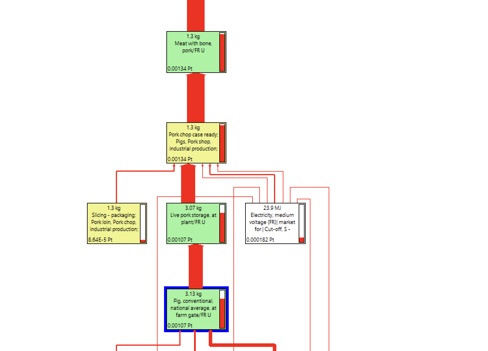

# 🐖 Jambon


**Page en construction**


## Construction de l'ingrédient jambon à partir du procédé agricole

Le jambon correspond à l'ICV suivant :&#x20;

* 'Cooked ham, case ready, at plant' (kilogram, FR, None)

$$
JambonREF
$$

Ce procédé est construit à partir du procédé :&#x20;

* Pig, conventional, national average, at farm gate

$$
PorcREF
$$

* de procédés d'abattage, découpe etc. :

<figure><figcaption></figcaption></figure>

<figure><figcaption></figcaption></figure>

On construit différents procédés de jambon **(N)**, sur la base du procédé de référence ('Cooked ham, case ready, at plant' (kilogram, FR, None)), en appliquant les opérations d'abattage à différents procédés de porc sortie de ferme **(N)**.

$$
ImpactJambon_N = (ImpactJambonREF - ImpactPorcREF )+ImpactPorc_N
$$

## Procédés retenus

| Label / Origine        | France                                                                                                                                                   | Autres pays                                                                                                                                              |
| ---------------------- | -------------------------------------------------------------------------------------------------------------------------------------------------------- | -------------------------------------------------------------------------------------------------------------------------------------------------------- |
| Conventionnelle        | 
<strong>JambonREF</strong> 'Cooked ham, case ready, at plant' (kilogram, FR, None) Porc : Pig, conventional, national average, at farm gate
 | 
<strong>JambonREF</strong> 'Cooked ham, case ready, at plant' (kilogram, FR, None) Porc : Pig, conventional, national average, at farm gate
 |
| Agriculture biologique | 
<strong>JambonBio</strong> Procédé construit (cf. formule) Porc : Pig, organic, system n°2, at farm gate
                                    | 
<strong>JambonBio</strong> Procédé construit (cf. formule) Porc : Pig, organic, system n°2, at farm gate
                                    |


Le porc bio considéré dans un premier temps pour le calcul du jambon bio est celui dont l'impact est proche de l'impact moyen des procédés porc bio ci-dessous


Pig, organic, at farm gate

Pig, organic, system n°1, at farm gate

Pig, organic, system n°2, at farm gate

Pig, organic, system n°3, at farm gate

Pig, organic, system n°4, at farm gate

