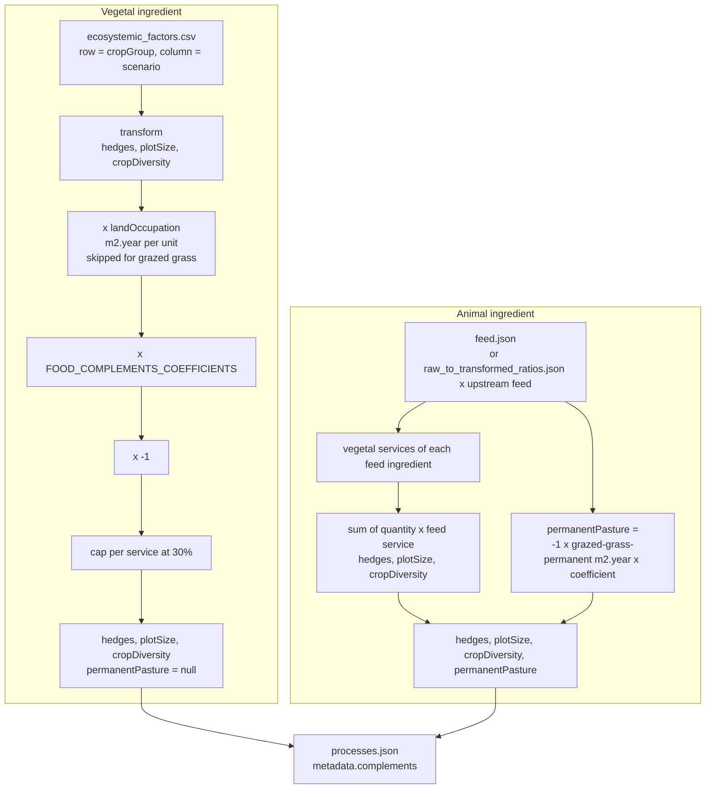
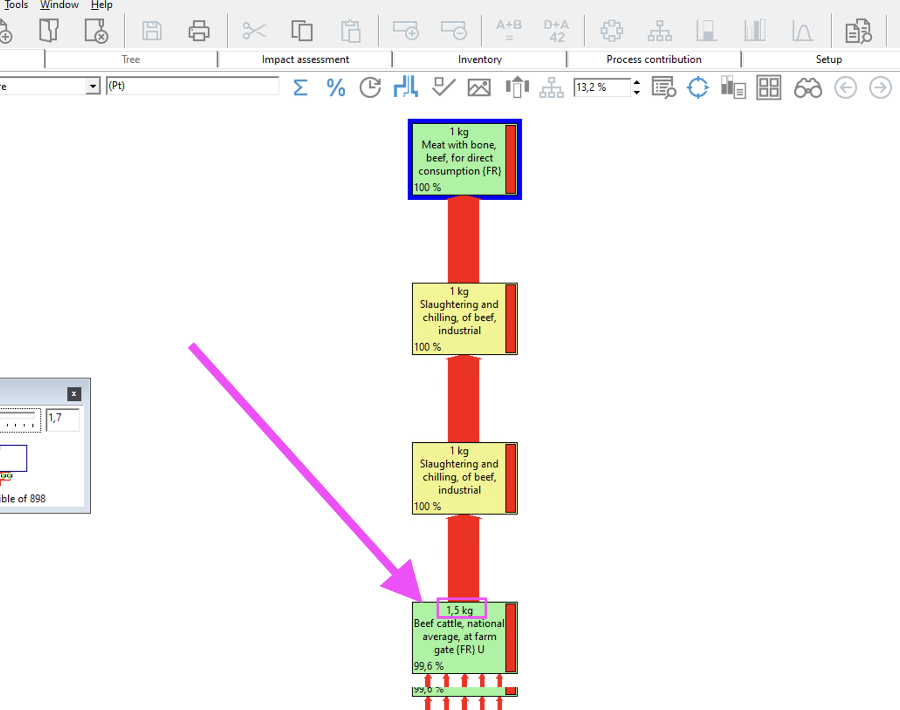
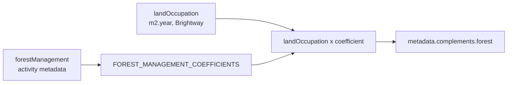

# Complements

Complements are bonuses or maluses added to the ecoscore for things LCA
doesn't cover. Two kinds are computed by the pipeline and written to
`metadata.complements` in `processes.json`:

- ecosystemic services for food ingredients: `hedges`, `plotSize`,
  `cropDiversity`, `permanentPasture`
- `forest` for wood processes

Code: `ecobalyse_data/export/complements.py`. The generic export
(`export_generic.py`) calls the forest function directly and goes through
`compute_es_for_ingredients` in `export/food.py` for food. The food input files are in
`food/ecosystemic_services/`.

### Sign:
same as impacts. <0 -> decreased environmental impact, >0 -> increased environmental impact.
process.

## Food ecosystemic services



An ingredient is vegetal if its food metadata has `landOccupation`,
`cropGroup` and `scenario`. Otherwise it's animal.

### Vegetal

Only `hedges`, `plotSize` and `cropDiversity` are computed here (see
`ecosystemic_services_list` in `config.py`). `permanentPasture` stays null.

For each service:

1. Read the raw factor in `food/ecosystemic_services/ecosystemic_factors.csv`, row `cropGroup`, column
   `<service>_<scenario>` (scenario is `reference`, `organic` or `import`).
   Hedges are in linear metres per hectare, plot size in hectares, crop
   diversity is a Simpson number.

2. Apply `es_transform`. Higher output = better service = lower environmental impact. Plot in
   `food/ecosystemic_services/es_transformations.png` (generated by
   `plot_es_transformations` in `complements.py`).

   If scenario = `import` columns of the CSV are 0 / 9 / 4 for every crop group, which
   makes all three transforms return 0: no bonus for imported ingredients.

3. Multiply by `landOccupation` (m2.year per unit of process), computed in
   `export/land_occupation.py`, unless a value is hardcoded in the activity
   metadata. Skipped for the two grazed grass processes (`grazed_grass_*_key` in
   `settings.toml`), which are already in m2.year.

4. Multiply by `FOOD_COMPLEMENTS_COEFFICIENTS[service]`. Coefficients were
   calibrated so that the complement is a fixed % bonus on a reference ingredient
   (cropDiversity = 10% bonus on organic soft wheat), see
   https://github.com/MTES-MCT/ecobalyse/issues/2051.

5. Multiply by -1 so that <0 -> decreased environmental impact

6. Cap: `max(value, -0.3 * |ecs|)`. Per service, so the three vegetal complements together
 can only decrease ecoscore of 90% max. See https://github.com/MTES-MCT/ecobalyse/issues/2304.

### Animal

Feed comes from `feed.json` for direct products (live animal, milk, eggs). For
transformed products (meat, cheese) it's the feed of the upstream raw product
times the ratio in `raw_to_transformed_ratios.json`. Quantities are in the unit
of the feed process, except grazed grass in m2.year.

Each feed ingredient first gets its own vegetal services (coefficient and cap
included). Then:

- `hedges`, `plotSize`, `cropDiversity` = sum of `quantity * feed_service`.
- `permanentPasture` = `-1 * grazed-grass-permanent quantity * coefficient`.

#### feed.json

In `food/ecosystemic_services/`. Each key is a live animal/egg/milk ingredient alias. The value is an object mapping feed ingredient aliases to quantities. Doesn't include meat ingredients.
Each quantity is expressed in the unit of the processes except `grazed-grass-...` which is in m2.year
For example `silage-maize-fr-2025` is in kg so to produce 1 kg of `milk-2025` you need :
- 0.175 m2.year of `grazed-grass-permanent-2025`
- 0.349 kg of `silage-maize-fr-2025` and so on...

Example:

```json
{
  "milk-2025": {
    "grazed-grass-permanent-2025": 0.175,
    "grazed-grass-temporary-2025": 0.438,
    "silage-maize-fr-2025": 0.349,
    "soft-wheat-fr": 0.0857,
    "soybean-br-deforestation": 0.0646
  },
  "beef-cattle-conventional-fr-live": {
    "grazed-grass-permanent-2025": 16.2318,
    "grazed-grass-temporary-2025": 2.18543,
    "silage-maize-fr-2025": 1.47682,
    "soft-wheat-fr": 0.549669,
    "soybean-br-deforestation": 0.231788
  },
}
```

#### raw_to_transformed_ratios.json

In `food/ecosystemic_services/`. Links transformed ingredients (meat, cheese, …) to their upstream raw product (live animal, milk, …) and the quantity of raw needed to produce 1 kg of transformed.

Keyed by **raw** (upstream) alias. Each value maps a **transformed** (downstream) alias to an object:

```json
{
  "beef-cattle-conventional-fr-live": {
    "beef-with-bone":    { "ratio": 1.5,  "source": "brightway_manual", "source_ref": "" },
    "beef-without-bone": { "ratio": 1.875, "source": "brightway_manual", "source_ref": "" },
    "ground-beef-2025":  { "ratio": 2.3,  "source": "brightway_manual", "source_ref": "" }
  },
  "cow-milk-fr": {
    "blue-cheese-auvergne-fr": { "ratio": 4.47, "source": "cmaps_custom_lci", "source_ref": "blue-cheese-auvergne-v1" }
  }
}
```

To produce 1 kg of `beef-with-bone` you need 1.5 kg of `beef-cattle-conventional-fr-live`, so its feed is 1.5 × the feed of `beef-cattle-conventional-fr-live` (which is in `feed.json`).

Fields:

- `ratio` — kg of raw per kg of transformed.
- `source` — one of:
  - `brightway_manual` — hand copy-pasted from a Brightway/Simapro activity exchange.
screenshot of a simapro window displaying the 1.5 ratio for beef-with-bone 

  - `cmaps_custom_lci` — taken from the first exchange of a `from_scratch` entry in `custom_lci.json`
  - `manual` — neither of the above.
- `source_ref` — reference a reviewer can use to find the ratio in the source system:
  - For `cmaps_custom_lci`: the `alias` in `custom_lci.json` (e.g. `blue-cheese-auvergne-v1`).

How to update:

- **Brightway rows.** See screenshot for Simapro. In Brightway, from the transformed activity navigate to the raw_activity. For each activity get the input_amount and output_amount. The ratio is the product of the input_amount/output_amount, eg "How much raw_activity is needed to get 1 unit of transformed_activity".
- **CMAPS rows.** Ensure a `from_scratch` entry exists in `custom_lci.json`. Set `ratio` equal to the first exchange's `amount`, `source` to `"cmaps_custom_lci"`, and `source_ref` to that entry's `alias`. The test `tests/test_raw_to_transformed_ratios.py::test_cmaps_rows_match_custom_lci` enforces this consistency.

## Forest



`compute_forest_complement`, for processes with `forestManagement` in their
metadata.
