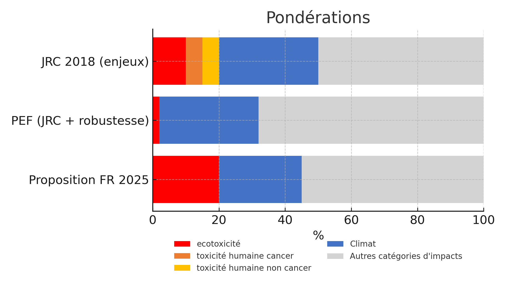

# Catégories d'impact ACV

L'analyse de Cycle de Vie vise à décrire tous les impacts environnementaux, à toutes les étapes de production (du berceau à la tombe) d'un produit. L'approche est expliquée en détails sur le[ site web agribalyse](https://doc.agribalyse.fr/documentation/les-donnees/methodologie-acv) par exemple.&#x20;

## Impacts agrégés et impacts détaillés

Ecobalyse permet de visualiser **2 impacts agrégés**, c'est à dire regroupant différents impacts après normalisation et pondération :&#x20;

* le **coût environnemental**, qui traduit le calcul d'impacts selon la méthode de l'Etat français ; donc en ajustant les pondérations PEF et en ajoutant quelques indicateurs complémentaires.&#x20;
* un **score "pondération PEF"** tel que défini dans la [recommandation de la Commission européenne du 16 décembre 2021](https://eur-lex.europa.eu/legal-content/EN/TXT/?uri=PI_COM%3AC%282021%299332) sur l'utilisation des méthode d'évaluation des empreintes environnementales. Ce score applique uniquement les indicateurs PEF avec leurs pondérations initiales. A noter qu'il n'a pas été possible d'utiliser les données EF à ce stade pour des raisons de propriété intellectuelle.

**Le détail des catégories d'impacts ACV** peut également être consulté dans ecobalyse :&#x20;

* Les 16 catégories d'impacts de la méthode PEF
* La catégorie d'impact corrigée relative à l'écotoxicité

Les coefficients de normalisation et de pondération mobilisées pour la construction de ces scores agrégés sont détaillés dans l'explorateur d'Ecobalyse alimentation : [https://ecobalyse.beta.gouv.fr/#/explore/food](https://ecobalyse.beta.gouv.fr/#/explore/food)

Pour l'affichage des résultats par "sous-scores", les impacts sont ensuite agrégés suivant la **règle de l'affectation unique** introduite dans le rapport du Conseil scientifique. Chaque catégorie d'impacts est ainsi rattachée à la catégorie à laquelle elle contribue le plus.

<figure><figcaption>
Répartition des catégories suivant la règle de l'affectation unique
</figcaption></figure>

## Normalisations et pondérations

Les calculs de la partie ACV coût environnemental et du score PEF s'effectuent à partir d'une somme pondérée des catégories d'impacts, chacune étant préalablement normalisée.

$$
ImpactAgrégé =\sum (Pondération_i * \frac{Impact_i}{Normalisation_i})
$$

Les niveaux de normalisation et de pondération sont détaillés dans l'[explorateur des impacts pour l'alimentaire d'Ecobalyse](https://ecobalyse.beta.gouv.fr/#/explore/food).

Pour la construction du coût environnemental, **les mêmes coefficients de normalisation que ceux du score PEF** sont appliqués.

Pour la **pondération**, la méthode de l'affichage environnemental établit que : &#x20;

* la pondération du changement climatique est maintenue à 21,06% ;
* la pondération de l'écotoxicité eau douce est réhaussée à 21,06% ;
* les pondérations des indicateurs de toxicité humaine cancer et non-cancer sont fixées à zéro, ce qui revient à supprimer ces indicateurs du coût environnemental ;
* les autres pondérations sont proportionnelles aux pondérations PEF initiales, mais réduite afin que la somme des pondérations reste bien à 100% après l'introduction des trois modifications précédentes.

L'illustration ci-après montre les principales évolutions des coefficients de pondération en considérant :&#x20;

* la proposition initiale du JRC (2018), avant prise en compte du coefficient de robustesse (donc à partir des enjeux perçus)
* la pondération annexée à la recommandation PEF de la Commission européenne de décembre 2021
* la pondération présentée, en mars 2023, à l'occasion de la mise en ligne d'une version beta d'Ecobalyse
* la pondération exposée aujourd'hui dans Ecobalyse pour servir de support à une concertation technique

<figure><figcaption></figcaption></figure>
