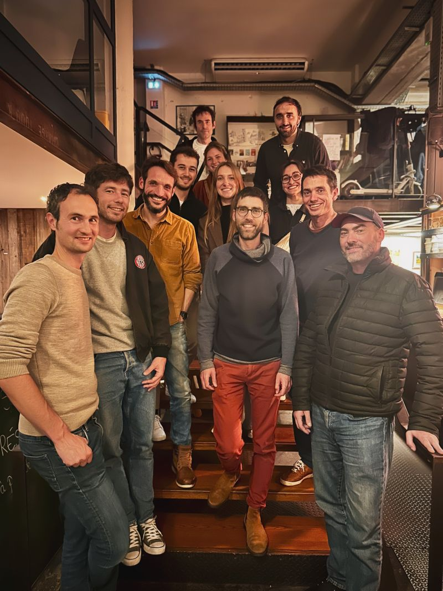

# L'équipe ecobalyse

L'équipe Ecobalyse réunit des professionnels animés par une mission commune : accélérer la mise en place de l'affichage environnemental en France. Notre équipe est placée sous l'égide du Ministère de l'Environnement et de l'ADEME, avec des salariés et des freelances. Elle combine des compétences variées en développement informatique, analyse de cycle de vie, design UX/UI, et expertise sectorielle. \
\

<figure><figcaption></figcaption></figure>

* _Les membres actuels :_

| Nicolas Perriault                                                                                                                 |
| --------------------------------------------------------------------------------------------------------------------------------- |
| Vincent Jousse                                                                                                                    |
| Camille Coquelet                                                                                                                  |
| Paul Boosz                                                                                                                        |
| Christophe Combelles                                                                                                              |
| Nathalie Rosenberg                                                                                                                |
| Alban Fournier, référent secteur ameublement                                                                                      |
| Maurine Poirier, référente secteur textile                                                                                        |
| Nicolas Planchenault, référent véhicule et "méthode transversale"                                                                 |
| Gabrielle Lestat, référente secteur alimentaire                                                                                   |
| Thomas Menant, Coach                                                                                                              |
|  Vincent Colomb, intrapreneur ADEME, responsable scientifique |
| Lisa Chenerie, intrapreneure MTE                                                                                                  |
| Pascal Dagras, intrapreneur MTE                                                                                                   |
|                                                                                                                                   |

* _Les anciens_

Livio Lumbroso : Coach

Plus de détails sur : [https://beta.gouv.fr/startups/ecobalyse.html](https://beta.gouv.fr/startups/ecobalyse.html)

&#x20;
