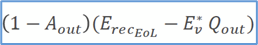

# Fin de vie des composants


Cette section concerne les secteurs objets et véhicules. Les secteurs Textile et Alimentaire ne sont pour l'instant pas concernés par cette méthode.



Ce modèle est en cours de déploiement. Les paramètres intégrés dans la première version en développement sont clairement indiqués.


## Contexte &#x20;

### Les scénarios de fin de vie du produit

Les scénarios de fin de vie d'un produit peuvent être définis avec ces deux critères :&#x20;

* la capacité de la filière à collecter le produit en fin de vie (taux de collecte), éventuellement décliné en une collecte pour traitement local d'une part et une collecte pour export d'autre part,
* la recyclabilité du produit (oui vs non).

Le schéma ci-dessous montre les scénarios possibles de fin de vie :

<figure><figcaption></figcaption></figure>

### Le recyclage des matériaux

Les métaux ferreux (aciers) et dans une moindre mesure les métaux non ferreux (aluminium notamment), ont un taux de recyclage élevé quelle que soit la fin de vie du produit. En effet, même dans les ordures ménagères incinérées, des systèmes permettent d'extraire ces matériaux.

Si le produit est collecté et recyclable, les matériaux sont recyclés, incinérés ou mis en décharge selon des ratios spécifiques à chaque matériau.

## Méthode de calcul

### Grands principes

Ecobalyse utilise la méthode CFF (Circulat Footprint Formula) pour évaluer l'impact de la fin de vie des produits.

Les matériaux constitutifs d'un produit (définis dans les composants) sont utilisés pour évaluer cette fin de vie. A chaque matériaux est associé un type de matériaux, et le produit est éclaté par type de matériau pour évaluser l'impact de sa fin de vie.

A chaque type de matériaux sont attachés des ratios de recyclage et incinération, les paramètres CFF (A et Q) et des procédés d'inventaire de cycle de vie de recyclage, incinération et enfouissement.


La méthode CFF décrite ci-dessous est en cours de déploiement.



Le détail des calculs avec paramètres et procédés appliqués est disponible en téléchargeant le fichier mis à disposition dans la section "Exemples"


### Formules de calcul



Décomposition de l'impact par scénario de fin de vie (FS = Filière spécifique / HF = Hors filière)

$$
I_{EoL}=\sum_i \big(I_{EoL, FS,i}+I_{EoL, HF,i}\big)
$$



Impact des scénarios en fin de vie (FS = Filière spécifique / HF = Hors filière)

$$
I_{EoL,FS,i}=m_i*TC*r_p*\Big(R_{FS,rec,i}*I_{EoL,rec,i}+R_{FS,inc,i}*I_{EoL,inc,i}+(1-R_{FS,rec,i}-R_{S,inc,i})*I_{EoL,lan,i}\Big)
$$

$$
I_{EoL,HF,i}=m_i*(1-TC*r_p)*\Big(R_{HF,rec,i}*I_{EoL,rec,i}+R_{HF,inc,i}*I_{EoL,inc,i}+(1-R_{HF,rec,i}-R_{S,inc,i})*I_{EoL,lan,i}\Big)
$$



Avec :&#x20;

Niveau 0 :

* `I_EoL` : l'impact environnemental du produit en fin de vie, dans l'unité de la catégorie d'impact analysée
* `I_EoL,FS,i` : l'impact environnemental associé au type de matériau i et au traitement en filière spécifique, pour l'ensemble du produit, dans l'unité de la catégorie d'impact analysée
* `I_EoL,HF,i` : l'impact environnemental associé au type de matériau i et au traitement en hors filière, pour l'ensemble du produit, dans l'unité de la catégorie d'impact analysée


`I_EoL,FS,i` et `I_EoL,HF,i` sont indiqués dans la calculette Ecobalyse pour chaque type de matériau i


<figure><figcaption></figcaption></figure>

Niveau 1 :

* `m_i` : la masse relative au type de matériaux `i` dans le produit, en kg
* `TC` : le taux de collecte des produits, en %
* `r_p` : la recyclabilité produit, égale à 1 (produit recyclable, avec filière dédiée) ou 0 (pas de filière dédiée)
* `R_FS,rec,i` : la part de recyclage du matériau (i) lorsque le produit est collecté et recyclable
* `R_FS,inc,i` : la part d'incinération du matériau (i) lorsque le produit est collecté et recyclable
* `R_HF,rec,i` : la part de recyclage du matériau (i) lorsque le produit n'est pas collecté ou pas recyclable (fin de vie déchets divers)
* `R_HF,inc,i` : la part d'incinération du matériau (i) lorsque le produit n'est pas collecté ou pas recyclable (fin de vie déchets divers)
* `R_E,rec,i` : la part de recyclage du matériau (i) lorsque le produit est exporté (non utilisé à ce stade)
* `I_Eol,rec,i` : l'impact environnemental du recyclage d'un kg d'un matériau de la famille de matériaux `i`, dans l'unité de la catégorie d'impact analysée
* `I_EoL,inc,i` : l'impact environnemental de l'incinération d'un kg d'un matériau de la famille de matériaux `i`, dans l'unité de la catégorie d'impact analysée
* `I_EoL,lan,i` : l'impact environnemental de l'enfouissement d'un kg d'un matériau de la famille de matériaux `i` , dans l'unité de la catégorie d'impact analysée

## Paramètres retenus pour le coût environnemental&#x20;


Dans la première version, il est considéré que la recyclabilité produit est toujours effective (r\_p=1) et le taux de collecte est fixé à 70% pour tous les secteurs.


### Taux de collecte `TC`

Un taux de collecte de 70% est appliqué par défaut pour l'ensemble des produits, sauf mention explicite contraire dans les pages sectorielles.&#x20;

### Recyclabilité produit `r_p`&#x20;

La recyclabilité de chaque produit est définie selon des règles spécifiques à chaque secteur. Se référer aux pages sectorielles.&#x20;

### Taux de collecte pour export `TE`

Un taux de collecte pour export de 0% est appliqué par défaut pour l'ensemble des produits, sauf mention explicite contraire dans les pages sectorielles.

### Taux de recyclage, d'incinération et de mise en décharge `R_FS,rec`, `R_FS,inc,i`, `R_HF,rec,i`, `R_HF,inc,i`



Ces paramètres sont appliqués pour les produits collectés et traité dans une filière spécifique. A ce jour les paramètres sont communs à tous les secteurs. Ils ont vocation à être définis définis secteur par secteur et seront alors indiqués dans les pages Fin de vie sectorielles.

Voir [page sectorielle Fin de vie Ameublement](https://fabrique-numerique.gitbook.io/ecobalyse/ameublement/cycle-de-vie/etape-4-fin-de-vie-ameublement), avec à ce jour les même données.

<table><thead><tr><th width="188.9000244140625">Type de matériau i</th><th width="153.10003662109375">Taux de recyclage R_FS,rec,i</th><th width="143.199951171875">Taux d'incinération R_FS,inc,i</th><th width="168.4000244140625">Taux d'enfouissement</th></tr></thead><tbody><tr><td>Métaux ferreux</td><td>100%</td><td>0%</td><td>0%</td></tr><tr><td>Aluminium</td><td>100%</td><td>0%</td><td>0%</td></tr><tr><td>Cuivre</td><td>100%</td><td>0%</td><td>0%</td></tr><tr><td>Bois</td><td>69%</td><td>31%</td><td>0%</td></tr><tr><td>Emballage carton</td><td>85%</td><td>11%</td><td>4%</td></tr><tr><td>Verre</td><td>80%</td><td>20%</td><td>0%</td></tr><tr><td>Caoutchouc</td><td>4%</td><td>94%</td><td>2%</td></tr><tr><td>Composites</td><td>0%</td><td>82%</td><td>18%</td></tr><tr><td>PET</td><td>92%</td><td>8%</td><td>0%</td></tr><tr><td>PP</td><td>92%</td><td>8%</td><td>0%</td></tr><tr><td>PEHD</td><td>92%</td><td>8%</td><td>0%</td></tr><tr><td>PEBD</td><td>7%</td><td>68%</td><td>25%</td></tr><tr><td>Plastiques rigides</td><td>41%</td><td>35%</td><td>24%</td></tr><tr><td>PUR</td><td>4%</td><td>94%</td><td>2%</td></tr><tr><td>Fibres synthétiques</td><td>27%</td><td>52%</td><td>21%</td></tr><tr><td>Fibres organiques</td><td>27%</td><td>52%</td><td>21%</td></tr><tr><td>Carte de circuit imprimé</td><td>100%</td><td>0%</td><td>0%</td></tr><tr><td>Cellule de batteries</td><td>100%</td><td>0%</td><td>0%</td></tr></tbody></table>



Ce scénario est applicable par défaut pour les produits non collectés ou non recyclables :&#x20;

<table><thead><tr><th width="249.20001220703125">Type de matériau</th><th width="147.7000732421875">Recyclage (R_HF,Rec,i)</th><th width="138.699951171875">Incinération (R_HF,Inc,i)</th><th width="154.89990234375">Enfouissement (R_HF,Enf,i)</th></tr></thead><tbody><tr><td>Métaux ferreux</td><td>95%</td><td>5%</td><td>0%</td></tr><tr><td>Aluminium</td><td>50%</td><td>41%</td><td>9%</td></tr><tr><td>Cuivre</td><td>50%</td><td>41%</td><td>9%</td></tr><tr><td>Autres matériaux</td><td>0%</td><td>82%</td><td>18%</td></tr></tbody></table>


Sources :&#x20;

* Tous matériaux (hors métaux) : données issues du scénario "meubles collectés non recyclables" de la filière Ameublement (cf. référentiel Meubles Meublants 2023/FCBA )
* Métaux : compromis entre les données FCBA (référence ci-dessus) et les données tous secteurs confondu (86% des emballages aciers et 37% des emballages aluminium sont recyclés (Citeo, 2023).




## Procédés utilisés pour le coût environnemental

Les procédés utilisés sont identifiés dans l'Explorateur de procédé.&#x20;

Ils sont également détaillés ci-dessous.

<table data-full-width="false"><thead><tr><th width="113.6666259765625">Matériau (i)</th><th width="166.66656494140625">Recyclage</th><th>Incinération (source : Ecoinvent 3.9.1)</th><th>Enfouissement (source : Ecoinvent 3.9.1)</th></tr></thead><tbody><tr><td>Bois (massif &#x26; panneaux)</td><td>n/a (cut-off)</td><td>Treatment of waste wood, untreated, municipal incineration, CH</td><td>Treatment of municipal solid waste, sanitary landfill, RoW</td></tr><tr><td>Métal</td><td>n/a (cut-off)</td><td>Treatment of scrap steel, municipal incineration with fly ash extraction, CH</td><td>Treatment of municipal solid waste, sanitary landfill, RoW</td></tr><tr><td>Rembourré / Matelas</td><td>n/a (cut-off)</td><td>Treatment of waste polyurethane, municipal incineration FAE, CH</td><td>Treatment of municipal solid waste, sanitary landfill, RoW</td></tr><tr><td>Plastique</td><td>n/a (cut-off)</td><td>Treatment of waste plastic, mixture, municipal incineration with fly ash extraction, CH</td><td>Treatment of municipal solid waste, sanitary landfill, RoW</td></tr><tr><td>Emballage (carton)</td><td>n/a (cut-off)</td><td>Treatment of waste paperboard, municipal incineration with fly ash extraction, CH</td><td>Treatment of municipal solid waste, sanitary landfill, RoW</td></tr><tr><td>Emballage (plastique)</td><td>n/a (cut-off)</td><td>Treatment of waste plastic, mixture, municipal incineration with fly ash extraction, CH</td><td>Treatment of municipal solid waste, sanitary landfill, RoW</td></tr><tr><td>Emballage (autre)</td><td>n/a</td><td>Treatment of municipal solid waste, municipal incineration, FR</td><td>Treatment of municipal solid waste, sanitary landfill, RoW</td></tr><tr><td>Autres</td><td>n/a</td><td>Treatment of municipal solid waste, municipal incineration, FR</td><td>Treatment of municipal solid waste, sanitary landfill, RoW</td></tr></tbody></table>

Les procédés recyclage ont été créés par Ecobalyse en suivant la méthode CFF, avec les paramètres et suivants (issus autant que possible de la réglementation PEF ou autre source réglementaire) :&#x20;


Le recyclage d'un matériau donné est évalué comme suit par la CFF : 

Avec&#x20;

* A\_out un facteur d'allocation des coûts / crédit entre la fin de vie du produit analysé et l'utilisation du matériau recyclé dans un nouveau produit, sur la base de l'équilibre offre/demande du marché
  * A faible : la matière recyclée est fortement demandée, l'enjeu est d'encourager le recyclage en fin de vie. Faible bénéfice à l'usage de matière recyclé, fort bénéfice au recyclage en fin de vie
  * A élevé : la matière recyclée est peu demandée, l'enjeu est d'encourage son usage. Fort bénéfice à l'usage de matière recyclé, faible bénéfice au recyclage en fin de vie
* E\_rec,EoL l'impact du recyclage du matériaux
* E\_v\* l'impact du matériau vierge évité
* Q\_out quantifie la qualité de la matière recyclée, en comparaison de la matière vierge.
  * Q\_out = 0.8 signifie qu'1kg de matière recyclée permet de remplacer 0.8kg de matière vierge (propriétés mécaniques, chimique...)


<table><thead><tr><th width="352.29998779296875">Type de matériau</th><th width="120">Paramètre CFF A_out</th><th width="120">Paramètre CFF Q_out</th></tr></thead><tbody><tr><td>Métaux ferreux</td><td>0.2</td><td>1.00</td></tr><tr><td>Aluminium</td><td>0.2</td><td>1.00</td></tr><tr><td>Cuivre</td><td>0.2</td><td>1.00</td></tr><tr><td>Bois</td><td>0.7</td><td>0.85</td></tr><tr><td>Emballage carton</td><td>0.2</td><td>1.00</td></tr><tr><td>Verre</td><td>0.2</td><td>1.00</td></tr><tr><td>Caoutchouc</td><td>0.5</td><td>0.75</td></tr><tr><td>Composites</td><td>0.5</td><td>0.80</td></tr><tr><td>PET</td><td>0.5</td><td>0.95</td></tr><tr><td>PP, PEHD, PELD, autres plastiques rigides</td><td>0.5</td><td>0.90</td></tr><tr><td>PUR</td><td>0.5</td><td>0.75</td></tr><tr><td>Fibres synthétiques</td><td>0.8</td><td>0.30</td></tr><tr><td>Fibres organiques</td><td>0.8</td><td>0.30</td></tr><tr><td>Carte de circuit imprimé</td><td>0.2</td><td>1.00</td></tr><tr><td>Cellule de batteries - Al, Cu, Fe</td><td>0.2</td><td>1</td></tr><tr><td>Cellule de batteries - Co, Ni, Mn, Li</td><td>0.2</td><td>1</td></tr></tbody></table>

#### Coût environnemental (Pt d'impact / kg)&#x20;

<table><thead><tr><th width="267">Matériau (i)</th><th>Irec(i)</th><th>Iinc(i)</th><th>Ienf(i)</th></tr></thead><tbody><tr><td>Bois (massif &#x26; panneaux)*</td><td>0</td><td>2</td><td>25</td></tr><tr><td>Métal*</td><td>0</td><td>2</td><td>25</td></tr><tr><td>Rembourré/Matelas/Mousse*</td><td>0</td><td>100</td><td>25</td></tr><tr><td>Plastique*</td><td>0</td><td>80</td><td>25</td></tr><tr><td>Emballage (carton)**</td><td>0</td><td>6</td><td>25</td></tr><tr><td>Emballage (plastique)**</td><td>0</td><td>79</td><td>25</td></tr><tr><td>Emballage (autres)**</td><td>n/a</td><td>21</td><td>25</td></tr><tr><td>Autres matières</td><td>n/a</td><td>21</td><td>25</td></tr></tbody></table>

## Exemples&#x20;

Le détail des calculs avec paramètres et procédés appliqué est disponible en téléchargeant le fichier suivant :&#x20;

