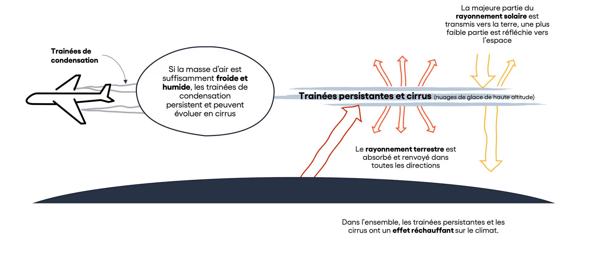

# ✈️ Transport par avion - prise en compte des trainées

## Contexte

Les trainées de condensation des avions (contrails en anglais) sont les traces blanches que l'on aperçoit dans le ciel derrière les avions. Ces trainées contribuent de façon significative au changement climatique. &#x20;

Actuellement **les procédés de transport aérien ecoinvent omettent l'impact de ces trainées sur le climat. Nous proposons donc une première approche simplifiée pour les intégrer dans le calcul du Cout environnemental**. Des travaux plus approfondis sont en cours, menés par Base Empreinte, et permettront de préciser la modélisation de ce phénomène à l'avenir.&#x20;


Les émissions de CO2 indiquées dans cette page correspondent uniquement aux émissions du Dioxyde de Carbone directement dans l'environnement. \
Il ne s'agit pas des émissions de CO2-équivalent, qui couvrent les émissions (directes et/ou indirectes) de tous les gaz à effet de serre en les ramenant au poids de CO2 équivalent en termes d'impact sur le changement climatique, \
Sauf mention contraire, l'unité utilisé ici est donc le kg de CO2, et non le kgCO2e.


### Part des émissions de CO2 dans le coût environnemental du transport par avion

Le procédé ecoinvent 3.9.1 "`market for transport, freight, aircraft, long haul, GLO` est utilisé comme référence pour modéliser l'impact environnemental du transport de biens par avion.

Le coût environnemental associé est de 59.32 Pt/tkm, dont 38.7% pour le changement climatique.

L'impact sur le changement climatique est de 0.8233 kgCO2e, dont 0.6282 kgCO2e (76%) due aux émissions directes de CO2 à la combustion.

Les émissions de CO2 à la combustion, évoquées dans la partie suivante, représentent donc, avant prise en compte des trainées, 30% du coût environnemental.

### Plus d'information sur les trainées d'avion

Le schéma suivant illustre le phénomène à l’œuvre :

<figure><figcaption>
Illustration des trainées d'avion, réalisée par Carbone 4 pour un <a href="https://www.carbone4.com/analyse-faq-aviation-climat">article dédié à ce sujet</a>
</figcaption></figure>

Une étude de 2021 ([D.S. Lee & al](https://www.sciencedirect.com/science/article/pii/S1352231020305689), 1) estime que les trainées d'avion représentent un forçage radiatif (RF) de 111 mW/m2 et un forçage radiatif effectif ("ERF") de 57.4 mW/m2. ,&#x20;

Par comparaison, le forcage radiatif (ERF=RF) est de 34.3mW/m2 pour les émissions de CO2 à la combustion.&#x20;

Une étude publiée en 2024 ([Roger Teoh et al](https://acp.copernicus.org/articles/24/6071/2024/), 2) sur les trainées de 2029 à 2021 évalue le forçage radiatif (RF) du aux trainées à 62.1mW/m2. Le forçage radiatif effectif n'est pas calculé spécifiquement dans cette étude. Cette seconde étude montre également qu'il existe de fortes différences entre les régions du monde. Notamment, le forçage radiatif du aux trainées est évalué à 876 mW m2 en Europe.


Ces études sont assorties de fortes incertitudes sur l'évaluation de l'impact des trainées : l'ERF est estimé entre 17 et 98 mW/m2 dans l'étude de D.S. Lee & al par exemple. On note également des éléments a priori contradictoire (ratio ERF/RF de 0.42 indiqué dans l'étude, contre 0.52 calculé).


**Principale documentation  :**

* [Rapport de synthèse sur les connaissances sur les trainées](https://rmi.org/insight/understanding-contrail-management-opportunities-challenges-and-insights/?submitted=1#thank-you), RMI, groupe de travail rassemblant divers types d'acteurs (entreprises du secteur aérien, ONG, instituts de recherche...)
* Article scientifiques de référence sur le sujet :
  * (1) [The contribution of global aviation to anthropogenic climate forcing for 2000 to 2018, D.S. Lee & al, Atmospheric Environment, Volume 244, 2021](https://www.sciencedirect.com/science/article/pii/S1352231020305689).
  * (2) [Global aviation contrail climate effects from 2019 to 2021 Roger Teoh et al (2024)](https://acp.copernicus.org/articles/24/6071/2024/)

## Méthode de calcul

L'intégration des trainées est réalisée en ajoutant artificiellement des émissions de CO2 (flux vers l'environnement) au procédé utilisé pour modéliser le transport aérien.

Cet ajout est réalisé au pro-rata du forçage radiatif, les émissions de CO2 et le forçage radiatif étant liés de façon linéaire.

### Création du procédé Ecobalyse

Le procédé ecoinvent 3.9.1 "`market for transport, freight, aircraft, long haul, GLO`" est modifié pour y ajouter les émissions de CO2 `e_{CO2,trainées}` modélisant "artificiellement" l'impact des trainées. Ces émissions sont calculées sur la base des émissions issus de la combustion du carburant `e_{CO2,combustion}`, principales contributrice de ce procédé en termes de changement climatique.&#x20;

$$
e_{CO2,trainées} = e_{CO2,combustion} * \frac{ERF_{trainées}}{ERF_{CO2,combustion}}
$$

Avec :

* `e_{CO2,trainées}` les émissions de CO2 ajoutées au procédé pour modéliser l'impact des trainées, en kg de CO2 / tkm
* `ERF_{CO2,combustion}` le forçage radiatif retenu pour les trainées : 57.4 mW/m2 (D.S. Lee & al, 1)
* `ERF_{trainées}` le forçage radiatif retenu relatif aux émissions directes de CO2 à la combustion : 34.3mW/m2  (D.S. Lee & al, 1)
* `e_{CO2,combustion}` les émissions de CO2 à la combustion pour le procédé `market for transport, freight, aircraft, long haul, GLO` : 0.6282 kg/tkm

$$
e_{CO2,trainées} = 1.05 kg/tkm
$$

Le coût environnemental du procédé ainsi obtenu est de 88.6 Pt/tkm.

**Cela correspond à une augmentation de 128% de l'impact sur le changement climatique, et à une augmentation de 49% du coût environnemental, par rapport au procédé de référence.**
