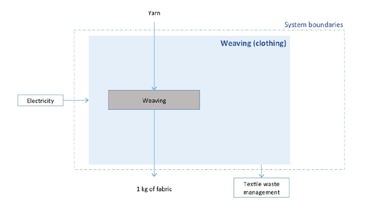

# Tricotage / Tissage

## Tissage ou tricotage ?

En fonction du type de vêtement sélectionné, une opération de tissage ou de tricotage est appliquée par défaut :


Le choix par défaut d'une opération de tissage ou de tricotage est un parti pris proposé ici. Il doit pouvoir être discuté et contesté s'il devait ne pas être approprié. Le choix pourrait au besoin être paramétrable.


| Type de vêtement | Opération appliquée par défaut |
| ---------------- | ------------------------------ |
| Châle            | Tissage                        |
| Echarpe          | Tissage                        |
| Débardeur        | Tricotage                      |
| T-shirt          | Tricotage                      |
| Gilet            | Tricotage                      |
| Jupe             | Tissage                        |
| Pantalon         | Tissage                        |
| Pull             | Tricotage                      |
| Chemisier        | Tissage                        |
| Manteau          | Tissage                        |
| Veste            | Tissage                        |
| Cape             | Tissage                        |
| Robe             | Tissage                        |
| Jean             | Tissage                        |

## Tricotage

### Schéma

Conformément à la documentation sectorielle textile de la [base Impacts](http://www.base-impacts.ademe.fr), le système "tricotage" est schématisé comme suit :

.PNG>)

Par conséquent, l'impact global du tricotage se comprend comme résultant de la somme de l'impact résultant du procédé de tricotage retenu (cf. intérieur du _system boundaries_) et des procédés externes devant être ajoutés, à savoir :

| Flux externe | UUID du flux                           | unité |
| ------------ | -------------------------------------- | ----- |
| Electricité  | `de442ef0-d725-4c3a-a5e2-b29f51a1186c` | MJ    |

La formule suivante s'applique donc :

$$
ImpactTricotage = ImpactProcédéTricotage + ImpactElec
$$

### Procédé de tricotage

L'impact du procédé de tricotage retenu est le produit de la masse "sortante", en l'occurrence la masse d'étoffe, avec le coefficient d'impact considéré (cf. [Impacts considérés](../impacts-consideres.md)).

$$
ImpactProcédéTricotage = MasseSortante(kg) * CoefImpactProcédéTricotage
$$


Remarque : pour les procédés de tricotage retenus (cf. ci-après), les coefficients d'impact sont tous nuls, de sorte que l'impact de l'étape de tricotage se limite finalement à l'impact de l'électricité nécessaire pour opérer ce processus.


Un seul procédé de tricotage est considéré :

| Procédé   | UUID                                 |
| --------- | ------------------------------------ |
| Tricotage | 9c478d79-ff6b-45e1-9396-c3bd897faa1d |


D'autres procédés de tricotage sont proposé dans la base impacts et pourraient, au besoin, être proposés en option ultérieurement.


| Procédés de tricotage alternatifs (non mobilisés)                 |
| ----------------------------------------------------------------- |
|  Tricotage, mailles jetées (indémaillable), inventaire désagrégé  |
|  Tricotage sans couture, inventaire désagrégé                     |
|  Tricotage rectiligne, inventaire désagrégé                       |
|  Tricotage fully-fashioned, inventaire désagrégé                  |
|  Tricotage circulaire, inventaire désagrégé                       |
|  Tricotage chaussant                                              |

### Pertes et rebut

Le procédé de tricotage considéré prévoit qu'une partie du fil mobilisé soit perdu, comme cela est représenté sur le schéma "system boundaries" ci-dessus (Flux intermédiaire - Textile Waste - UUID: `1cc67763-7318-4077-af4a-bcd0ab5ef33f`).

Ces pertes sont prises en compte comme suit :

$$
MasseEtoffeSortante(kg) + MassePertes(kg) = MasseFilEntrant(kg)
$$

Avec :

$$
MassePertes(kg) = MasseEtoffeSortante(kg) * CoefPertesProcedeTricotage
$$

Plus de détail sur la gestion des masses : [Pertes et rebut](../pertes-et-rebus.md).

### Electricité

La quantité d'électricité à mobiliser pour actionner le procédé de tricotage est le produit de la masse "sortante", en l'occurrence la masse de fil en sortie de filature, avec le coefficient du flux intermédiaire correspondant à l'électricité (`de442ef0-d725-4c3a-a5e2-b29f51a1186c`).

Elle s'exprime en MJ dans la table des flux intermédiaires attachés au procédé de teinture.

$$
ElecConsommée(MJ) = MasseSortante(kg) * CoefFluxElecProcédéTrictotage
$$

Le calcul d'impact de l'électricité ainsi mobilisée est détaillé dans la page suivante : [Electricité](../electricite.md).


L'électricité s'exprime en KWh dans la formule ci-dessous. Une division par 3,6 est donc nécessaire pour assurer le changement d'unité par rapport à l'électricité consommée, calculée d'abord en MJ.


$$
ImpactElec = ElecConsommée (KWh) * ImpactProcédéElec
$$

### Limites concernant le tricotage

* Possibilité / Opportunité d'ouvrir un paramétrage plus précis en choisissant d'autres procédés de tricotage ?

## Tissage

### Schéma

Conformément à la documentation sectorielle textile de la [base Impacts](http://www.base-impacts.ademe.fr), le système "tissage" est schématisé comme suit :

Par conséquent, l'impact global du trissage se comprend comme résultant de la somme de l'impact résultant du procédé de tissage retenu (cf. intérieur du _system boundaries_) et des procédés externes devant être ajoutés, à savoir :

| Flux externe                                                                         | UUID du flux                         | unité          |
| ------------------------------------------------------------------------------------ | ------------------------------------ | -------------- |
| 
Electricité par duite par mètre

<em>Electricity per pick per meter</em>
 | 9ea449e4-38fc-4133-b2d9-7942719c8675 | kWh / (pick,m) |


Attention, le flux externe d'électricité considéré pour le tissage est différent de celui appelé pour les autres étapes de production. Il s'exprime en kWh par duite et par mètre.


La formule suivante s'applique donc :

$$
ImpactTissage = ImpactProcédéTissage + ImpactElecParPM
$$

### Procédé de tissage

L'impact du procédé de tissage retenu est le produit de la masse "sortante", en l'occurrence la masse d'étoffe, avec le coefficient d'impact considéré (cf. [Impacts considérés](../impacts-consideres.md)).

$$
ImpactProcédéTissage = MasseSortante(kg) * CoefImpactProcédéTissage
$$


Remarque : pour les procédés de tissage retenus (cf. ci-après), les coefficients d'impact sont tous nuls, de sorte que l'impact de l'étape de tissage se limite finalement à l'impact de l'électricité nécessaire (par duite et par mètre) pour opérer ce processus.


Un seul procédé de tissage est considéré :

| Procédé               | UUID                                 |
| --------------------- | ------------------------------------ |
| Tissage (habillement) | f9686809-f55e-4b96-b1f0-3298959de7d0 |


D'autres procédés de tissage sont proposés dans la base impacts et pourraient, au besoin, être proposés en option ultérieurement.


| Procédés de tricotage alternatifs (non mobilisés)           |
| ----------------------------------------------------------- |
| Tissage (ameublement)                                       |
| Production d'un non-tissé aiguilleté, inventaire désagrégé  |
| Non tissé                                                   |

### Pertes et rebut

Le procédé de tissage considéré prévoit qu'une partie du fil mobilisé soit perdu, comme cela est représenté sur le schéma "system boundaries" ci-dessus (Flux intermédiaire - Textile Waste - UUID: `1cc67763-7318-4077-af4a-bcd0ab5ef33f`).

Ces pertes sont prises en compte comme suit :

$$
MasseEtoffeSortante(kg) = MasseFilEntrant(kg) + MassePertes(kg)
$$

Avec :

$$
MassePertes(kg) = MasseEtoffeSortante(kg) * CoefPertesProcedeTissage
$$

Plus de détail sur la gestion des masses : [Pertes et rebut](../pertes-et-rebus.md).

### Electricité (par duite et par mètre)

La quantité d'électricité à mobiliser pour actionner le procédé de tissage est le produit de **l'unité de tissage** avec le coefficient du flux intermédiaire correspondant à l'électricité (9ea449e4-38fc-4133-b2d9-7942719c8675).

$$
ElecConsommée(kWh) = UnitéTissage(duite.m) * CoefFluxElecProcédéTissage(kWh/(duite.m))
$$

Le calcul nécessite donc que soit préalablement établie l'unité de tissage. Celle-ci est définie dans la documentation sectorielle de l'ADEME (Méthodologie d'évaluation des impacts environnementaux des articles d'habillement - formule n°3 - p29)

$$
UnitéTissage(duite.m) = Duitage(duite/m) / Grammage(g/m2) * MasseEntrante (g)
$$

Toujours en application de la documentation sectorielle ADEME (tableau p28), des valeurs par défaut sont utilisées pour le duitage et le grammage.

| Type de vêtement | Duitage par défaut (duite/m) | Grammage par défaut (g/m2) |
| ---------------- | ---------------------------- | -------------------------- |
| Châle            | 1600                         | 140                        |
| Echarpe          | 1600                         | 140                        |
| Débardeur        | N/A tricotage                | N/A tricotage              |
| T-shirt          | N/A tricotage                | N/A tricotage              |
| Gilet            | N/A tricotage                | N/A tricotage              |
| Jupe             | 5000                         | 40                         |
| Pantalon         | 3000                         | 140                        |
| Pull             | N/A tricotage                | N/A tricotage              |
| Chemisier        | 5000                         | 40                         |
| Manteau          | 1600                         | 140                        |
| Veste            | 3000                         | 140                        |
| Cape             | 1600                         | 140                        |
| Robe             | 5000                         | 40                         |
| Jean             | 3000                         | 140                        |


Les vêtements doublés ne sont pas pris en compte à ce stade. Les valeurs par défaut des duitages et grammages sont différentes dans la méthodologie pour les vêtements doublés.


Le calcul d'impact de l'électricité ainsi mobilisée est détaillé dans la page suivante : [Electricité](../electricite.md).


L'électricité s'exprime en KWh dans la formule ci-dessous. Contrairement aux autres procédés, il n'est pas nécessaire de faire une conversion de MJ à kWh dans ce cas.


$$
ImpactElec = ElecConsommée (KWh) * ImpactProcédéElec
$$

### Limites concernant le tissage

* Prendre en compte des vêtements doublés, avec des valeurs par défaut (duitage, grammage) différentes.
* Permettre de modifier les paramètres de l'unité de tissage (duitage, grammage) qui semblent très impactants.

## Limites générales

Pour mieux rendre compte de la diversité des pratiques, le choix d'une technique de tissage ou de tricotage, pour la préparation de l'étoffe, pourrait être rendu paramétrable.
