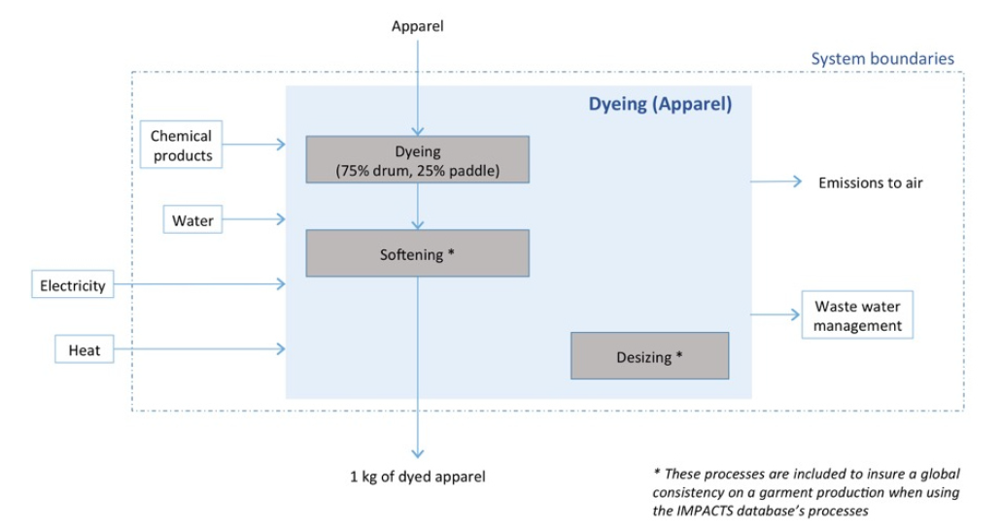

# Teinture

## Schéma

Conformément à la documentation sectorielle textile de la [base Impacts](http://www.base-impacts.ademe.fr), le système "teinture" est schématisé comme suit :

Par conséquent, l'impact global de l'étape de teinture se comprend comme résultant de la somme de l'impact résultant du procédé de teinture retenu (cf. intérieur du _system boundaries_) et des procédés externes devant être ajoutés, à savoir :

| Flux externe | UUID du flux                           | Unité |
| ------------ | -------------------------------------- | ----- |
| Chaleur      | `32045a18-e8a3-4068-9078-d17c72cea73d` | MJ    |
| Electricité  | `de442ef0-d725-4c3a-a5e2-b29f51a1186c` | MJ    |

La formule suivante s'applique donc :

$$
ImpactTeinture = 
ImpactProcédéTeinture 
+ ImpactChaleur 
+ ImpactElec
$$

## Procédé de teinture

L'impact du procédé de teinture retenu est le produit de la masse "sortante" avec le coefficient d'impact considéré (cf. [Impacts considérés](impacts-consideres.md)).

$$
ImpactProcédéTeinture = MasseSortante(kg) * CoefImpactProcédéTeinture
$$

Suivant le pays dans lequel la teinture est réalisée, un choix de procédé par défaut est réalisé.&#x20;


**Ce choix de procédé relève d'une orientation spécifique à l'outil et devant être confrontée aux pratiques effectivement observées dans l'industrie**.


Les principes à appliquer pour opéré ces choix sont introduit dans la page suivante : [Hypothèses par défaut](hypotheses-par-defaut.md)

| Pays       | Support de teinture | Positionnement | Traitement des eaux | UUID                                   |
| ---------- | ------------------- | -------------- | ------------------- | -------------------------------------- |
| Bangladesh | étoffe              | majorant       | inefficace          | `cf001531-5f2d-48b1-b30a-4a17466a8b30` |
| Chine      | étoffe              | majorant       | inefficace          | `cf001531-5f2d-48b1-b30a-4a17466a8b30` |
| Espagne    | étoffe              | représentatif  | très efficace       | `fb4bea16-7ce1-43e2-9e03-462250214988` |
| France     | étoffe              | représentatif  | très efficace       | `fb4bea16-7ce1-43e2-9e03-462250214988` |
| Inde       | étoffe              | majorant       | inefficace          | `cf001531-5f2d-48b1-b30a-4a17466a8b30` |
| Portugal   | étoffe              | représentatif  | très efficace       | `fb4bea16-7ce1-43e2-9e03-462250214988` |
| Tunisie    | étoffe              | majorant       | inefficace          | `cf001531-5f2d-48b1-b30a-4a17466a8b30` |
| Turquie    | étoffe              | majorant       | inefficace          | `cf001531-5f2d-48b1-b30a-4a17466a8b30` |

**Support de teinture** : alternativement, des teintures sur fil ou sur article pourraient être modélisées

**Positionnement** : le choix de positionnement, majorant ou représentatif est très impactant, notamment pour les impacts en matière de changement climatique. L'efficacité du traitement de l'eau est par ailleurs très impactante sur l'eutrophisation eau douce. Afin que la sensibilité de ces paramètres puisse être appréciée, il est proposé de moduler le caractère représentatif ou majorant du procédé de teinture, ainsi que l'efficacité du traitement des eaux usées, retenus en déplaçant le curseur de sélection entre ces deux situations extrêmes. Dans ce cas, l'impact du procédé de teinture résulte d'une pondération entre les impacts potentiels de ces deux procédés :&#x20;

* procédé représentatif / traitement très efficace des eaux usées dans le cas le plus favorable (curseur à gauche)
* procédé majorant / traitement inefficace des eaux usées dans le cas le plus défavorable (curseur à droite)


Curseur ajustable permettant d'ajuster le caractère majorant du procédé de teinture retenu


Si le curseur de sélection est utilisé, avec `a` le pourcentage (%) traduisant le caractère majorant retenu (`100%` pour un procédé complètement majorant/inefficace et `0%` pour un procédé complètement représentatif/efficace) :

$$
ImpactTeinture = a * ImpactProcédéMajorantInefficace + (1-a) * ImpactProcédéReprésentatifEfficace
$$

## Pertes et rebut

Les différents procédés de teinture ne prévoyant pas de perte (Flux intermédiaire - Textile Waste - UUID: `1cc67763-7318-4077-af4a-bcd0ab5ef33f`), les masses de produit en entrée et en sortie du procédé sont identiques.

Plus de détail sur la gestion des masses : [Pertes et rebut](pertes-et-rebus.md).

## Chaleur

La quantité de chaleur à mobiliser pour actionner le procédé de teinture est le produit de la masse "sortante", par exemple la masse d'étoffe en sortie de tissage-tricotage, avec le coefficient du flux intermédiaire correspondant à la chaleur (`32045a18-e8a3-4068-9078-d17c72cea73d`).

Elle s'exprime en MJ.

$$
ChaleurConsommée(MJ) = MasseSortante(kg) * CoefFluxChaleurProcédéTeinture
$$

Le calcul d'impact de la chaleur ainsi mobilisée est détaillé dans la page [Chaleur](chaleur.md).

$$
ImpactChaleur = ChaleurConsommée (MJ) * ImpactProcédéChaleur
$$

## Electricité

La quantité d'électricité à mobiliser pour actionner le procédé de teinture est le produit de la masse "sortante", par exemple la masse d'étoffe en sortie de tissage-tricotage, avec le coefficient du flux intermédiaire correspondant à l'électricité (`de442ef0-d725-4c3a-a5e2-b29f51a1186c`).

Elle s'exprime en MJ dans la table des flux intermédiaires attachés au procédé de teinture.

$$
ElecConsommée(MJ) = MasseSortante(kg) * CoefFluxElecProcédéTeinture
$$

Le calcul d'impact de l'électricité ainsi mobilisée est détaillé dans la page suivante : [Electricité](electricite.md).


L'électricité s'exprime en KWh dans la formule ci-dessous. Une division par 3,6 est donc nécessaire pour assurer le changement d'unité par rapport à l'électricité consommée, calculée d'abord en MJ.


$$
ImpactElec = ElecConsommée (KWh) * ImpactProcédéElec
$$

## Limites

Dans un premier temps, seule la teinture est prise en compte dans le simulateur.

Il conviendrait, d'intégrer progressivement les différents traitements qui peuvent relever de l'ennoblissement, ou de la finalisation du vêtement :

* apprêts chimiques
* apprêts mécaniques
* enduction
* impression

## Modifications à apporter

Modification du tableau par pays pour y intégrer la Grèce

| Pays       | Support de teinture | Positionnement                              | Traitement des eaux                           | UUID                                                                                                              |
| ---------- | ------------------- | ------------------------------------------- | --------------------------------------------- | ----------------------------------------------------------------------------------------------------------------- |
| Bangladesh | étoffe              | majorant                                    | inefficace                                    | `cf001531-5f2d-48b1-b30a-4a17466a8b30`                                                                            |
| Chine      | étoffe              | majorant                                    | inefficace                                    | `cf001531-5f2d-48b1-b30a-4a17466a8b30`                                                                            |
| Espagne    | étoffe              | représentatif                               | très efficace                                 | `fb4bea16-7ce1-43e2-9e03-462250214988`                                                                            |
| France     | étoffe              | représentatif                               | très efficace                                 | `fb4bea16-7ce1-43e2-9e03-462250214988`                                                                            |
| Grèce      | étoffe              | 
50% représentatif

50% majorant
 | 
50% très efficace

50% inefficace
 | 
50% - <code>fb4bea16-7ce1-43e2-9e03-462250214988</code>

<code>50% - 2d-48b1-b30a-4a17466a8b30</code>
 |
| Inde       | étoffe              | majorant                                    | inefficace                                    | `cf001531-5f2d-48b1-b30a-4a17466a8b30`                                                                            |
| Portugal   | étoffe              | représentatif                               | très efficace                                 | `fb4bea16-7ce1-43e2-9e03-462250214988`                                                                            |
| Tunisie    | étoffe              | majorant                                    | inefficace                                    | `cf001531-5f2d-48b1-b30a-4a17466a8b30`                                                                            |
| Turquie    | étoffe              | majorant                                    | inefficace                                    | `cf001531-5f2d-48b1-b30a-4a17466a8b30`                                                                            |
