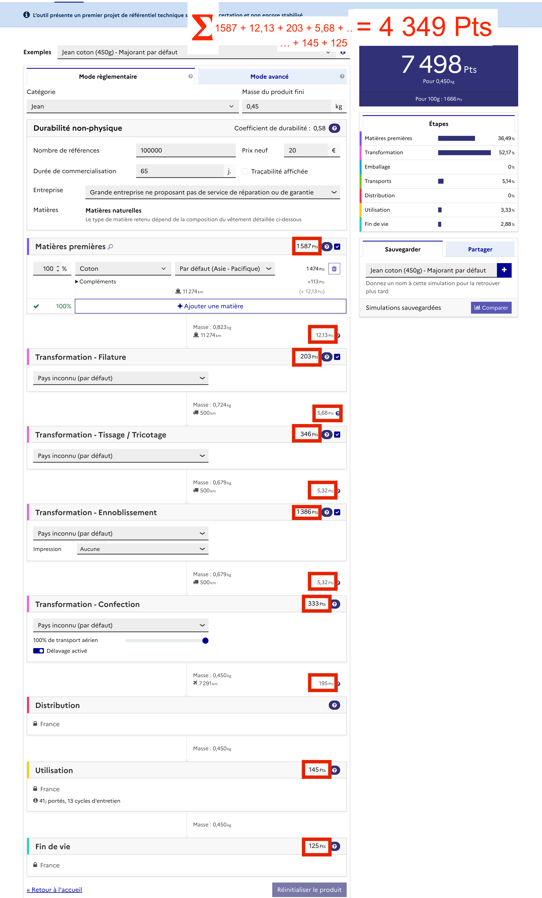

# Aide API

<figure><figcaption>
UI "Jean coton (450g) - Majorant par défaut" au 2024-06-06
</figcaption></figure>

## Comment retrouver ce résultat (7498 Pts) dans l'API ?

<figure><figcaption>
API "Jean coton (450g) - Majorant par défaut" au 2024-06-06, impact total
</figcaption></figure>

On retrouve bien ce chiffre dans la réponse de l'API dans /impacts/ecs (ecs = ecoscore)

## Comment retrouver ce résultat  (7498 Pts) dans l'API à partir de la décomposition par impacts ?

1. Il faut faire la somme des sous-impacts en les normalisant/pondérant. On arrive à 7114 Pts.

<figure><figcaption>
Calcul de l'écoscore "ecs" à partir des sous-impacts et des compléments
</figcaption></figure>

2. Il faut aussi ajouter les compléments (ici microfibers et outOfEuropeEOL) que l'on retrouve dans l'API sous complementsImpacts. On a comme valeur 194 Pts pour le compléments microfibres et 190 Pts pour le compléments fin de vie hors europe.

.png>)

En additionnant les compléments aux sous-impacts on a donc : 7114 + 194 + 190 = 7498 Pts. On retrouve bien le résultat attendu.


Remarque : on peut voir que la valeur du compléments microfibre affiché dans l'UI est de 113 Pts, ce qui est différent de ce qui est affiché dans l'API (194 Pts).

En effet dans l'UI les valeurs (hors valeurs "total" dans l'encadré bleu) sont affichés AVANT la prise en compte du coefficient de  [durabilite.md](durabilite.md "mention"). Ainsi pour obtenir les valeurs finales il faut diviser le score par le coefficient de durabilité. \
Pour le complément microfibres par exemple 113/0.58 \~ 195. On retrouve bien l'ordre de grandeur de 194 Pts affiché dans l'API.


## Comment retrouver ce résultat  (7498 Pts) à partir des étapes du cycle de vie ?

### UI

Si l'on fait la somme de toutes les impacts de chaque étape du cycle de vie, on arrive à 4349 Pts. On est loin des 7498 Pts affiché dans l'interface, pourquoi ?

<figure><figcaption>
UI "Jean coton (450g) - Majorant par défaut" au 2024-06-06
</figcaption></figure>

Dans l'UI les valeurs (hors valeurs "total" dans l'encadré bleu) sont affichés AVANT la prise en compte du coefficient de  [durabilite.md](durabilite.md "mention"). Ainsi pour obtenir les valeurs finales il faut diviser le score par le coefficient de durabilité. On obtient bien ainsi 4349 /0.58 = 7498 Pts.

### API

Dans l'API le fonctionnement est le même. Dans la décomposition par étape du cycle de vie "lifecycle" les valeurs sont AVANT la prise en compte du coefficient de durabilité.\

<figure><figcaption>
API "Jean coton (450g) - Majorant par défaut" au 2024-06-06, impact "Matières premières" donc AVANT durabilité
</figcaption></figure>

De même que dans l'UI, hors décomposition par étapes du cycle de vie ("lifecycle"), les valeurs dans l'API sont APRES prise en compte du coefficient de durabilité.&#x20;

<figure><figcaption>
API "Jean coton (450g) - Majorant par défaut" au 2024-06-06, impact total donc APRES durabilité
</figcaption></figure>
