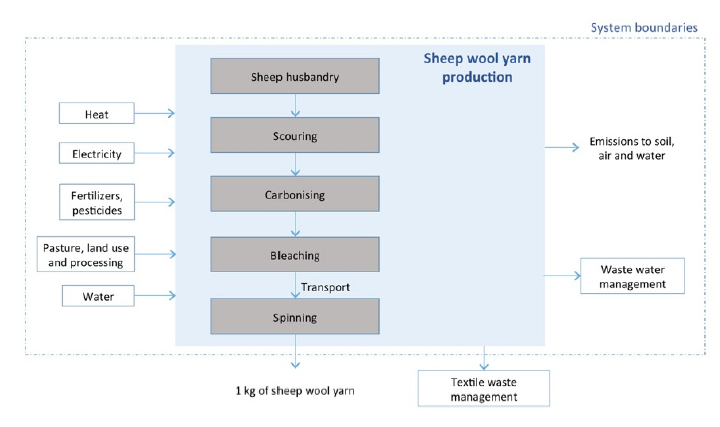

# ❤ 1 - Etape Matière et filature dans la Base Impacts (old)


Dans les données utilisées (Base Impacts), les étapes de matière et filature sont fusionnées. Elles ont donc forcément lieu dans le même pays. Cela est limitant car dans de nombreux cas, la filature n'a pas lieu dans le pays de production de la matière.\
Nous avons donc tenté de séparer ces 2 étapes.\
Pour en savoir plus sur notre méthodologie de séparation de ces étapes, [voir la section Séparation Matière et Filature](filature-1.md)


## Matières proposées

La liste des matières disponibles dans Ecobalyse est visible dans l'[Explorateur Matière](https://ecobalyse.beta.gouv.fr/#/explore/textile/materials)&#x20;

* Pour chaque matière il est indiqué l'**Origine Géographique**, c'est à dire le continent (ou parfois le pays) d'origine dans la Base Impacts. Néanmoins pour faire nos calculs de transport et [pour la séparation des étapes de matière et de filature](filature-1.md), nous avons besoin de faire des calculs à partir d'un pays.\

* C'est pourquoi il est aussi indiqué le **Pays de production et de filature par défaut.** Ce pays est une hypothèse que nous faisons pour les calculs de transport et de [séparation des étapes de matière et de filature.](filature-1.md)


* Pour le fil de soie, la documentation sectorielle indique simplement une géographie mondiale (GLO), en précisant que celle-ci correspond à la production mondiale. Considérant que cette production est très majoritairement asiatique (source), on retient par défaut une géographie asiatique.
* La géographie "Asie" n'est pas explicitement pointée pour la filature dans la documentation sectorielle. C'est toutefois une hypothèse qui semble crédible au regard de la part des pays asiatiques dans la production mondiale ([lien](https://fr.wikipedia.org/wiki/Fibre\_synth%C3%A9tique)) et d'informations fournies par ailleurs dans la documentation, par exemple sur les étapes de texturisation, de thermofixation et de lavage qui sont généralement faites en Asie.


## Cas du multi-matière

* Pour l'étape Matière : Il est possible d'ajouter plusieurs matières. Dans le cas où l'on ajoute des matières ayant des **Pays de production et de filature par défaut,** on fait l'hypothèse que toutes les matières ont le **Pays de production et de filature par défaut** de la matière la plus présente (en %).
* Pour l'étape de Filature : on fait l'hypothèse que la filature a lieu par défaut dans le **Pays de production et de filature par défaut** de la matière la plus présente (en %). Mais il est toujours possible de paramétrer un autre pays. Dans ce cas la filature de toutes les matières aura lieu dans ce pays (il est impossible de paramétrer la filature de chaque matière dans un pays différent).&#x20;

## Documentation des procédés Base Impacts


Dans la suite de cette page, vous trouverez pour information une documentation des procédés matière+filature de la Base Impacts. Néanmoins nous n'utilisons pas ces procédés brutes car [nous séparons les étapes de matière et de filature.](filature-1.md)


### Schéma

Conformément à la documentation sectorielle textile de la [base Impacts](http://www.base-impacts.ademe.fr/), le système "matière et filature", est schématisé comme suit (exemple de la fibre de laine de mouton et du filament de viscose) :

### Procédé de matière et filature

L'impact du procédé de confection retenu est le produit de la masse "sortante", en l'occurrence le fil, avec le coefficient d'impact considéré (cf. [Impacts considérés](../../impacts-consideres.md)).

$$
ImpactProcédéMatièreFilature = MasseSortante(kg) * CoefImpactProcédéMatièreFilature
$$

Les procédés correspondant aux différents choix de matières sont listés dans les 3 tableaux en haut de cette page méthodologique.

### Pertes et rebut

Les procédés de Matière et filature considérés prévoient qu'une partie de la matière première mobilisée soit perdue, comme cela est représenté sur les schémas _System Boundaries_ ci-dessus (Flux intermédiaire - Textile Waste - UUID: `1cc67763-7318-4077-af4a-bcd0ab5ef33f`).

Ces pertes sont prises en compte comme suit :

$$
MasseFilSortante(kg) + MassePertes(kg) = MasseMatièreEntrante(kg)
$$

Avec :

$$
MassePertes(kg) = MasseFilSortante(kg) * CoefPertesProcedeMatièreFilature
$$

