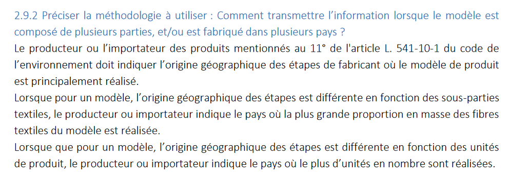

# Paramétrage

La méthodologie de calcul du coût environnemental peut être utilisée en mobilisant des paramètres très différents : masse du vêtement, catégorie, matières, origines, grammage, prix de référence, délavage, transport par avion, ...&#x20;

## <mark style="color:red;">Approche réglementaire</mark>

**Au plan réglementaire**, 3 types de paramètres sont à distinguer :&#x20;

* **Les paramètres&#x20;**<mark style="color:purple;">**obligatoires**</mark>**, nécessaires** au calcul du coût environnemental
* **Les paramètres optionnels**, pouvant être précisés dans le cadre du calcul du coût environnemental
* **Les paramètres figés**, ne pouvant pas être modifiés dans le cadre du calcul du coût environnemental, en se limitant au paramétrage de référence.

<table><thead><tr><th width="220">Paramètre</th><th width="126">Statut</th><th>Commentaire</th></tr></thead><tbody><tr><td><ol><li><mark style="color:purple;">Catégorie de produit</mark></li></ol></td><td><mark style="color:purple;">Obligatoire</mark></td><td></td></tr><tr><td><ol start="2"><li><mark style="color:purple;">Masse du produit fini</mark></li></ol></td><td><mark style="color:purple;">Obligatoire</mark></td><td></td></tr><tr><td><ol start="3"><li>Caractère remanufacturé ou non du produit fini</li></ol></td><td>Optionnel</td><td></td></tr><tr><td><ol start="4"><li>Nombre de références - Durabilité</li></ol></td><td>Optionnel</td><td>Valeur par défaut correspondant à la mode "ultra fast fashion".</td></tr><tr><td><ol start="5"><li>Prix de référence - Durabilité</li></ol></td><td>Optionnel</td><td>Valeur par défaut correspondant à la mode "ultra fast fashion".</td></tr><tr><td><ol start="6"><li>Entreprise et service de réparation - Durabilité</li></ol></td><td>Optionnel</td><td>Valeur par défaut correspondant à la mode "ultra fast fashion".</td></tr><tr><td><ol start="7"><li><mark style="color:purple;">Nature et pourcentage des matières premières</mark></li></ol></td><td><mark style="color:purple;">Obligatoire</mark></td><td>Ces matières doivent représenter au moins 2% de la masse total du produit et 5%de l'impact total.</td></tr><tr><td><ol start="8"><li>Origine géographique des matières premières</li></ol></td><td>Optionnel </td><td>Valeur par défaut correspondant à Inde.</td></tr><tr><td><ol start="9"><li>Origine géographique de la filature</li></ol></td><td>Optionnel</td><td>Valeur par défaut correspondant à Inde.</td></tr><tr><td><ol start="10"><li>Type de filature</li></ol></td><td>Figé</td><td>Le type de filature dépend des matières considérées.</td></tr><tr><td><ol start="11"><li>Titrage du fil</li></ol></td><td>Figé</td><td>Le titrage du fil est rattaché à la catégorie de produit.</td></tr><tr><td><ol start="12"><li><mark style="color:purple;">Origine géographique du tissage/tricotage</mark></li></ol></td><td><mark style="color:purple;">Obligatoire</mark></td><td>Valeur par défaut correspondant à Inde.</td></tr><tr><td><ol start="13"><li>Procédé de tissage ou tricotage</li></ol></td><td>Figé</td><td>Le procédé dépend de la catégorie sélectionnée.</td></tr><tr><td><ol start="14"><li>Grammage</li></ol></td><td>Figé</td><td>Le grammage est rattaché à la catégorie de produit.</td></tr><tr><td><ol start="15"><li><mark style="color:purple;">Origine géographique de l'ennoblissement</mark></li></ol></td><td><mark style="color:purple;">Obligatoire</mark></td><td>Valeur par défaut correspondant à Inde.</td></tr><tr><td><ol start="16"><li>Type de teinture - Ennoblissement</li></ol></td><td>Figé</td><td>Le type de teinture peut être choisi en "mode exploratoire"</td></tr><tr><td><ol start="17"><li>Type d'impression et pourcentage de surface imprimée- Ennoblissement</li></ol></td><td>Optionnel</td><td>A sélectionner pour les vêtements imprimés</td></tr><tr><td><ol start="18"><li><mark style="color:purple;">Origine géographique de la confection</mark></li></ol></td><td><mark style="color:purple;">Obligatoire</mark></td><td>Valeur par défaut correspondant à Inde.</td></tr><tr><td><ol start="19"><li>Complexité de confection</li></ol></td><td>Figé</td><td>La complexité de la confection est rattaché à la catégorie de produit.</td></tr><tr><td><ol start="20"><li>Taux de perte - confection</li></ol></td><td>Figé</td><td>Le taux de perte en confection est rattaché à la catégorie de produit.</td></tr><tr><td><ol start="21"><li>Stocks dormants</li></ol></td><td>Figé</td><td>Le taux de stocks dormants est rattaché à la catégorie de produit.</td></tr><tr><td><ol start="22"><li>Application d'un procédé de délavage</li></ol></td><td>Optionnel</td><td>A sélectionner pour les produits imprimés.</td></tr><tr><td><ol start="23"><li>Part de transport aérien</li></ol></td><td>Optionnel</td><td>La valeur par défaut découle de l'origine géographique de la confection et du coefficient de durabilité.</td></tr><tr><td><ol start="24"><li>Liste des accessoires</li></ol></td><td>Optionnel</td><td></td></tr></tbody></table>

## <mark style="color:red;">Approche technique</mark>

**Au plan purement technique**, différents types de paramètres sont à distinguer :&#x20;

* des paramètres sans lesquels il est impossible de modéliser un coût environnemental ;
  * Catégorie de produit \[Attention : dans la calculette Ecobalyse, le choix de la catégorie de produit se fait nécessairement à partir du choix initial d'un exemple de produit relevant de la même catégorie que le produit que l'on souhaite modéliser]
  * Masse de produit fini
  * Matières premières (répartition et nature)
* des paramètres qui permettent de préciser la modélisation mais qui ne sont pas indispensables à la modélisation d'un coût environnemental
  * L'ensemble des autres paramètres sont donc caractérisées par des valeurs par défaut qui découlent des 3 paramètres mentionnés ci-dessus :&#x20;
    * La définition de la catégorie de produit vient préciser de nombreux paramètres par défaut : titrage, grammage, tissage/tricotage, délavage, stocks dormants, type de confection, taux de perte en confection, nombre d'utilisation entre chaque cycle d'entretien, procédés d'entretien, prix par défaut, coût de réparation, accessoires, (cf. paramètres par défaut attachés détaillés dans l'[explorateur de produits](https://ecobalyse.beta.gouv.fr/#/explore/textile/products))  &#x20;
    * Le choix de chaque matière permet de préciser : l'origine par défaut des matières en question, les pré-traitements, le type de teinture
    * Par défaut, le pays ou la région dans laquelle sont réalisées chaque étape de transformation peut être fixé à la valeur "Inconnu (par défaut)". Ce paramétrage est lié au mix électrique et au mix de chaleur les plus impactants (cf. [explorateur de pays](https://ecobalyse.beta.gouv.fr/#/explore/textile/countries)) . La part de transport aérien depuis l'atelier de confection découle quant à elle du pays (ou de la région) retenu pour cette étape \[_et du coefficient de durabilité - cf. section_ [_part du transport aérien_](https://fabrique-numerique.gitbook.io/ecobalyse/textile/cycle-de-vie-des-produits-textiles/transport#part-du-transport-aerien) ].


Les choix proposés de valeurs par défaut conduisent, très majoritairement, à appliquer des valeurs majorantes par défaut. Par défaut, un vêtement est transformé dans un pays "inconnu" qui a le mix électrique le plus impactant, les paramètres qui définissent le coefficient de durabilité caractérisent une mode de type "ultra fast fashion"...

2 exceptions :&#x20;

* CONFECTION -> le délavage, activé par défaut pour la catégorie "jeans" mais pas pour les autres catégories de produits
* ENNOBLISSEMENT -> l'impression, par défaut activée pour aucune catégorie de produit

Ces deux paramètres ne sont pas fixés, par défaut, sur des valeurs majorantes dans la mesure où ils peuvent être simplement constatés par l'observation du vêtement, sans avoir à recourir à des informations de traçabilité.

**Dès lors, à l'exception du délavage et de l'impression, chaque nouveau paramètre précisé à partir des valeurs par défaut doit conduire à réduire le coût environnemental modélisé.**



**Gestion du multi-sourcing**\
Plusieurs paramètres concernent le pays dans lequel la matière est produite ou dans lequel différentes étapes de transformation sont réalisées. La valeur à donner au paramètre peut être complexe lorsque, pour une même référence, un producteur s'approvisionne dans différents pays (multi-sourcing).\
Dans un souci de capitalisation sur la réglementation existante et pour éviter un double exercice aux marques, le multi-sourcing doit être considérées suivant les mêmes règles que celles définies pour l'application du décret n° 2022-748 du 29 avril 2022 relatif à l'information du consommateur sur les qualités et caractéristiques environnementales des produits générateurs de déchets ([lien](https://www.legifrance.gouv.fr/jorf/id/JORFTEXT000045726094)). Ces règles sont précisées dans la foire aux questions publiée le 18 octobre 2023 ([lien](https://www.ecologie.gouv.fr/sites/default/files/documents/FAQ-020123v2.pdf)), et en particulier dans le paragraphe 2.9.2. repris ci-après.\


