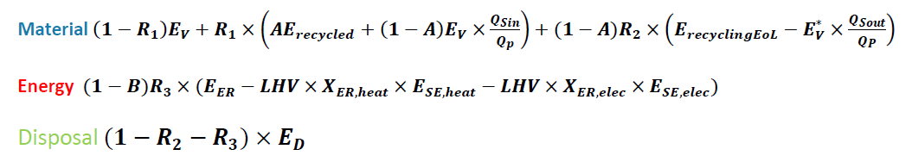
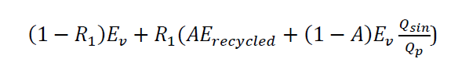

# 🤯 Circular Footpring Formula (CFF)

L'application de la méthodologie PEF, et plus particulièrement du projet de PEFCR Apparel & Footwear (A\&F) conduit à considérer la CFF pour la prise en compte de la fin de vie et des matières recyclées.

Cette formule est prise en compte à deux endroits dans le cycle de vie et la méthodologie correspondante :

## Matière

Les deux premiers termes de la ligne "Material" permettent de modéliser l'impact de la prise en compte de matière recyclée (R1) dans le produit.

Ils sont introduits dans la section relative à la CFF de la page "[Utilisation de matière recyclée M1 et M2](../cycle-de-vie-des-produits-textiles/etape-1-matieres/circular-footprint-formula-cff-matiere.md)".

## Fin de vie

Le troisième terme de la ligne "Material", construit autour du taux de recyclage R2, ainsi que les termes relevant de l'incinération et de la mise en décharge ("Energy" et "Disposal") sont introduits [dans une section relative à la CFF de la page "Fin de vie"](../cycle-de-vie-des-produits-textiles/etape-1-matieres/circular-footprint-formula-cff-matiere-1.md).
